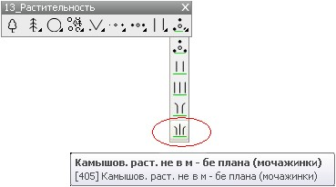
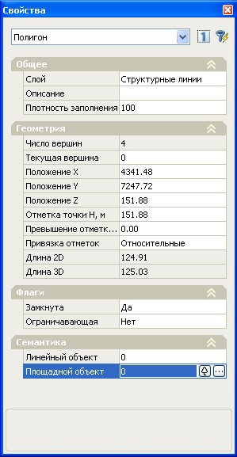

# Ввод площадных условных знаков в ЦММ

Площадные условные знаки представляют собой область заполнения замкнутых линейных объектов. Если же исходный линейный объект не является замкнутым, то при его заполнении площадным обозначением он замыкается автоматически. Дальнейшее редактирование положения площадной области производится путем перемещения узловых точек исходного линейного объекта (точек **ЦММ**).

Площадной условный знак, аналогично точечным и линейным, может вводиться в **ЦММ** с помощью специальных панелей, которые были описаны выше. Для этого:

1. Подведите курсор к соответствующей пиктограмме, появится информационная подсказка с указанием наименования условного знака:

   

2. Щелкните левой кнопкой мыши по пиктограмме, курсор примет форму прицела.
3. Укажите левой кнопкой мыши исходный линейный объект (замкнутый контур), для которого необходимо сделать площадное заполнение. Если контур был выбран заранее, то площадное заполнение после нажатия на соответствующей пиктограмме будет создано автоматически.

Площадные условные знаки могут также назначаться замкнутым структурным линиям через диалоговое окно **Свойства**.

Для этого:

1. Выберите структурную линию или группу структурных линий.
2. Нажмите правую кнопку мыши. Откроется контекстное меню. Выберите из контекстного меню пункт **Свойства**.
3. Появится окно **Свойства**, в котором будут указаны параметры выделенного объекта:

   

4. В области **Семантика**, напротив параметра **Площадной объект** щелкните левой кнопкой мыши по пиктограмме откроется **Библиотека площадных условных знаков**.
5. Откройте в боковой панели библиотеки соответствующую группу, в которой находится искомый условный знак. После выбора группы, все принадлежащие ей условные знаки отобразятся в основном графическом поле библиотеки.Для отображения требуемого условного знака, также можно воспользоваться строкой поиска, расположенной в верхней части библиотеки, введя туда его наименование:

   

6. Выберите нужный условный знак, дважды щелкнув по нему левой кнопкой мыши.

После этого данное условное обозначение (заполнение) будет автоматически присвоено предварительно выбранным замкнутым структурным линиям.
