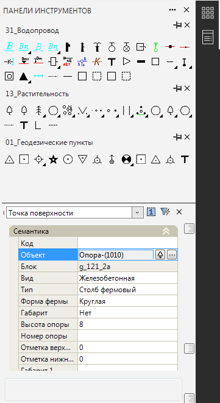
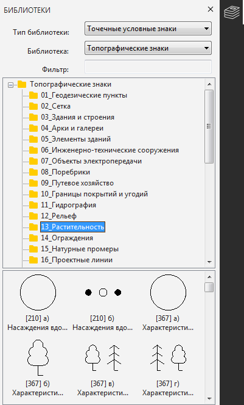

# Ввод условных знаков

В программе предусмотрены **Библиотеки условных знаков**.

По своему типу они разделяются на точечные, линейные и площадные. Они соответственно отвечают за стиль отображения точек, линий и замкнутых контуров **ЦММ**.

Условный знак объекту **ЦММ** может назначаться различными способами:

* Автоматически по изыскательскому коду (для точечных условных знаков).

   

   Подробнее о кодификаторе см. [Изыскательский кодификатор](../../codifier/settings_codifier.md).

   

* С помощью специализированного окна **Панели инструментов** и окна **Свойства**.

   

   

   Открытие данной панели и функционал работы с ней см. в разделе [Адаптация](../../../../install_startup/startup/general_setting/workspace.md). Вставка условных знаков с помощью данного функционала см. [Вставка точечных условных знаков в ЦММ](insert_dotty_conditional_signs.md)

   

* С помощью специализированного окна **Библиотеки**.

  
