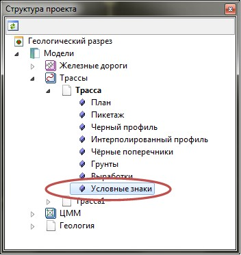
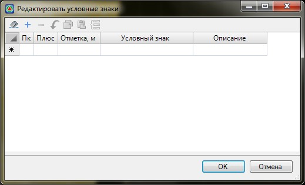
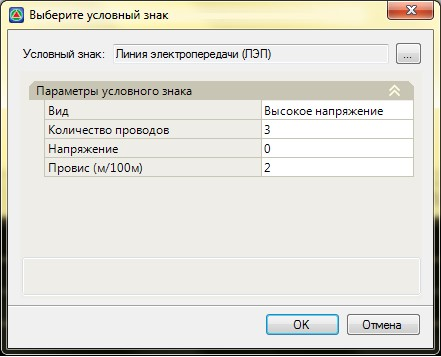
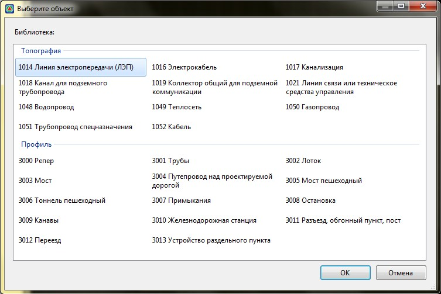
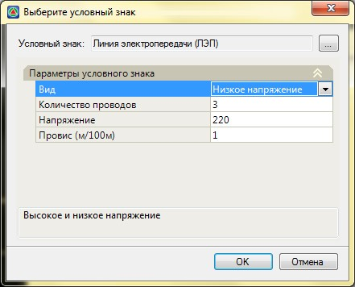
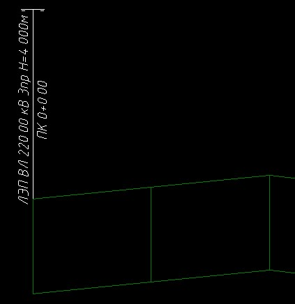

# Ввод условных знаков на продольном профиле

Различные линейные объекты (коммуникации), введенные в **ЦММ** автоматически отображаются на продольных профилях трасс, которые они пересекают. Также, для отображения различных объектов ситуации исключительно на продольном профиле трассы, можно воспользоваться табличным способом ввода.

Ввод условных знаков на профиле производится через таблицу **Условные знаки** соответствующей модели проекта (**Трассы, Автомобильные и Железные дороги**). Для ввода условных знаков:

1. Раскройте дерево структуры проекта до таблицы **Условные знаки**:

   

2. Двойным щелчком левой кнопки мыши откройте таблицу **Условные знаки**:

   

3. Заполните поля ввода **Пк**, **Плюс**, **Отметка** и при необходимости **Описание**. Для выбора необходимого условного знака щелкните в поле Условный знак и нажмите кнопку  , откроется диалоговое окно выбора условного знака:

   

4. Нажмите на кнопку  откроется Библиотека условных знаков:

   
   
   

   Данная библиотека является пополняемая и редактируемая, более подробно см. [Создание новых семантических объектов](../../../../annex/library_semantics/create_new_objects.md)

   

   Выберите необходимый условный знак и нажмите **Ок**.

5. В открывшемся окне задайте необходимые параметры условного знака:

   

   

   Каждому условному знаку соответствуют свои параметры.

   

 6. Нажмите **ОК**.

Далее можно продолжить добавление условных знаков в таблицу, либо выйти из нее нажав **ОК**.

В результате, добавленный условный знак отобразится на профиле трассы:

