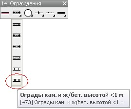
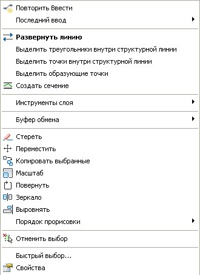
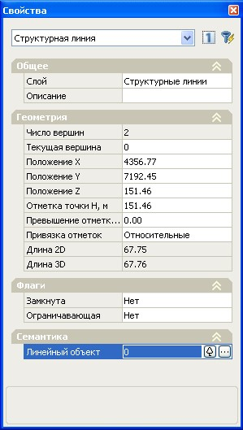
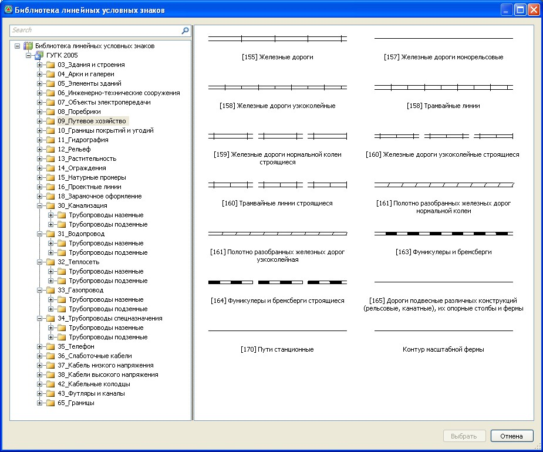

# Ввод линейных условных знаков

Линейный условный знак, аналогично точечным знакам, может вводиться в **ЦММ** с помощью специальных панелей, которые были описаны выше.

Принцип ввода линейных объектов схож с вводом структурных линий. Линейные объекты вводятся по точкам **ЦММ**, в противном случае в модель будут добавлены дополнительные точки, расположенные в узлах линейного контура и имеющие признак **Ситуационная**. Дальнейшее редактирование положения линий производится путем перемещения данных узловых точек (точек **ЦММ**).

Для вставки линейного объекта с условным знаком с панели:

1. Подведите курсор к соответствующей пиктограмме, появится информационная подсказка с указанием наименования условного знака. Если курсор подвести к соответствующей пиктограмме и задержать его на 1-2 секунды, то появится подробное описание данного условного знака.

   

2. Щелкните левой кнопкой мыши по пиктограмме, курсор примет форму прицела.
3. Укажите последовательно левой кнопкой мыши положение начального и последующих узлов линейного объекта.
4. Для выхода из режима ввода щелкните правой кнопкой мыши и выберите из появившегося контекстного меню пункт **Ввод**.

В результате, введенный линейный условный знак будет отображен в **ЦММ**.



 Некоторые линейные объекты, такие как: линии электропередач, трубопроводы различного назначения и прочие коммуникации, помимо топографического плана, могут отображаться на профилях и сечениях. Для корректно отображения коммуникаций на профилях и сечениях, им необходимо задать отметки в узлах. Процедура задания высотных отметок линейным объектам будет описана ниже.



Условный знак может назначаться уже предварительно созданным объектам, например полилиниям или структурным линиям. Для этого:

1. Выделите объект или группу объектов **ЦММ**, которым необходимо присвоить линейный условный знак.
2. Щелкните левой кнопкой мыши по соответствующей пиктограмме на панели условных знаков.

Линейные условные знаки могут также назначаться структурным линиям через диалоговое окно **Свойства**. Для этого:

1. Выберите структурную линию или группу структурных линий.
2. Нажмите правую кнопку мыши. Откроется контекстное меню:

   

3. Выберите опцию **Свойства**. Появится окно **Свойства**, в котором будут указаны параметры выделенного объекта:

   

4. В области **Семантика**, напротив параметра **Линейный объект** щелкните левой кнопкой мыши по пиктограмме . Откроется библиотека линейных условных знаков.
5. Откройте в боковой панели библиотеки соответствующую группу, в которой находится искомый условный знак. После выбора группы, все принадлежащие ей условные знаки отобразятся в основном графическом поле библиотеки. Для отображения требуемого условного знака также можно воспользоваться строкой поиска, расположенной в верхней части библиотеки, введя туда его наименование:

   

6. Выберите нужный условный знак, дважды щелкнув по нему левой кнопкой мыши.

После этого данное условное обозначение будет автоматически присвоено предварительно выбранным структурным линиям.
