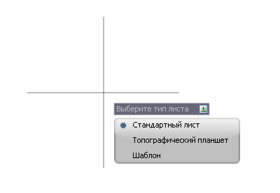
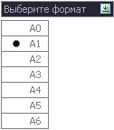
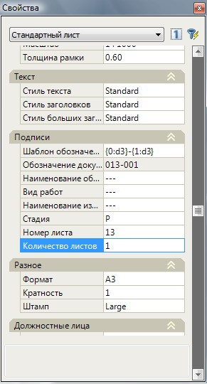
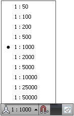
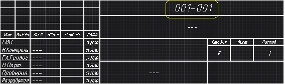
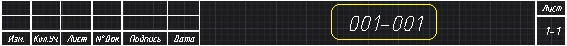
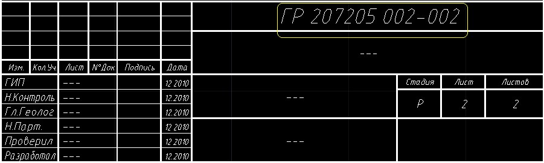
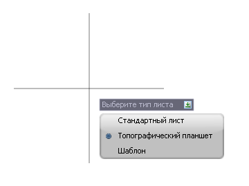
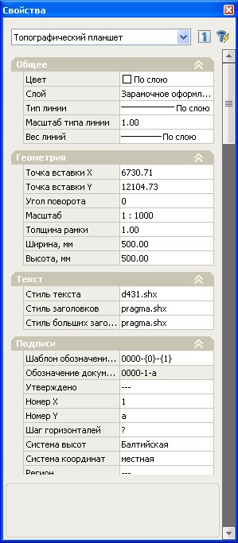
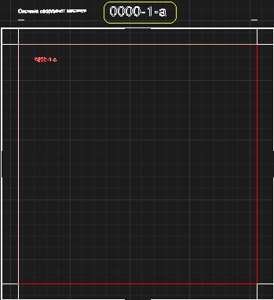

# Формирование планшетов

Программа позволяет производить раскладку листов и планшетов различных видов, форматов и масштабов, а также формировать их чертежи.



## Добавление нового листа

Для того чтобы добавить новый лист:

1. Выберите меню **Рисовать – Планшет – Добавить лист**, программа предложит выбрать один из вариантов:

   

2. Выберите пункт **Стандартный лист**, откроется контекстное меню выбора формата листа:

   

3. Выберите необходимый формат листа, курсор примет форму прицела.
4. Левой кнопкой мыши укажите точку вставки листа в модель.
5. Перемещая курсор, задайте визуально направление вставляемого листа (угол поворота относительно горизонтальной оси), для подтверждения направления щелкните правой кнопкой мыши.
6. При необходимости, перемещая курсор в заданном направлении, увеличьте длину листа (кратность), для подтверждения выбранного размера щелкните правой кнопкой мыши.



Работа с Пользовательскими форматами листов описана в разделе [Пользовательские шаблоны листов](../sheet_templates/add_user_template.md)







## Свойства стандартного листа

Для редактирования листов или внесения в них дополнительных параметров (подписи, стили текста и т.д.):

1. Выберите лист, который необходимо отредактировать, щелкнув по нему левой кнопкой мыши.
2. Щелкните по нему правой кнопкой мыши. Из открывшегося контекстного меню выберите пункт **Свойства**. Появится информационное окно **Свойства**:
 
   

В данном окне свойства листа разбиты на следующие группы:

### Общие

Изменяемым параметром в данной группе является **Слой**. С помощью выпадающего списка можно изменить слой выбранного листа.



 По умолчанию, при создании листа ему присваивается слой **Зарамочное оформление**.



### Геометрия

С помощью данной группы настроек можно изменить параметры точки вставки листа (координаты Х и У), а также его **Угол поворота**, **Масштаб листа** и **Толщину рамки**.



 По умолчанию, масштаб создаваемого листа будет соответствовать текущему масштабу модели, отображаемому в статусной строке, в нижней части рабочего окна.



### Текст

В данной группе настроек осуществляется настройка текстовых стилей **произвольного текста** и **Заголовков**, путем выбора необходимого текстового стиля из выпадающих списков.

### Подписи

Параметры данной группы предназначены для заполнения правой части основного штампа выбранного листа.

Более подробно рассмотрим параметр **Шаблон обозначения документа**, который предназначен для быстрого редактирования основной надписи выбранных листов (см. рис. ниже):

| Большой штамп                                                 | Малый штамп  |
| -----------                                                   | -----------  |
|  |       |

Поле **Шаблон обозначения документа**, у созданного листа, в окне **Свойства** выглядит следующим образом: **{0:d3}-{1:d3}**. Шаблон состоит из двух формул. Каждая формула определяет формирование числового значения, выделенного на рисунке:

1. **{0:d3}** – определяет формирование значения **Номер листа**.
2. **{1:d3}** – определяет формирование значения **Количество листов**.

Сами числовые значения (номер листа и их количество) задаются в диалоговом окне свойства листа, а данный шаблон формирует формат (правило записи) этих значений, в поле основной надписи обозначения документа.

Формулы, находящиеся в шаблоне могут быть отредактированы следующим образом. Может быть изменен порядок формул, а также какая-либо формула удалена.

Если параметр в формуле - **«0»**, то берется значение **Номера листа.**. Если параметр в формуле - **«1»**, то берется значение **Количества листов.**

**Параметр «d» и цифра**, определяет то количество знаков, из которых будет состоять значение. Например, если в формуле, которая отвечает за формирование значения **Номера листа** и Номер листа соответствует - 1, то если задано **«d4»** , значение отобразится следующим образом – 0001. если «d2», то – 01.



Примечание. В поле **Шаблон обозначения документа** можно так же добавить различные числовые или буквенные значения, например шифр или название проекта. Пример шаблона - «**ГР 207205 {0:d3}-{1:d2}**»



### Разное

С помощью данной группы настроек можно изменить **Формат** (А0…А6), **Кратность** (1…n) и **Штамп листа** (Без штампа, Малый или Большой штамп).

### Должностные лица

Параметры данной группы предназначены для заполнения левой части основного штампа листа.





## Добавление топографического планшета

Для того чтобы добавить новый планшет:

1. Выберите элемент меню **Рисовать – Планшет – Добавить лист**, программа предложит выбрать один из вариантов:

   
   
2. Выберите пункт **Топографический планшет**.
3. Курсор примет форму прицела, левой кнопкой мыши укажите точку вставки планшета в модель.





## Свойства топографического планшета

Для открытия окна **Свойства Топографического планшета**:

1. Выберите планшет, который необходимо отредактировать, щелкнув по нему левой кнопкой мыши.
2. Щелкните по нему правой кнопкой мыши, откроется контекстное меню.
3. Выберите пункт **Свойства**. Появится информационное окно **Свойства**:

   

### Общие

Параметры данной группы аналогичны параметрам **Стандартного листа**, которые были описаны выше.

### Геометрия

Параметры данной группы аналогичны параметрам **Стандартного листа**.

Для **Топографического** листа планшета имеется возможность задавать значение **Ширины** и **Высоты** в соответствующих полях.

### Текст

Параметры данной группы аналогичны параметрам **Стандартного листа**.

### Подписи

Параметры данной группы предназначены для заполнения различных данных топографического листа планшета.

Поле **Шаблон обозначения документа** топографического листа, выглядит следующим образом: **{0:d2}-{1}**. Шаблон также состоит из двух формул. Каждая формула определяет формирование значения, выделенного на рисунке:

В отличие от **Стандартного листа** формулы определяют формирование следующих параметров:

1. **{0:d2}** – определяет формирование значения **Номер Х**.
2. **{1}** – определяет формирование значения **Номер Y**.

**Параметр «d»** имеет аналогичные свойства, как у **Стандартного листа**.

Основное преимущество использования **Шаблонов** для формирования надписи, состоит в том, что у группы планшетов, при необходимости, можно быстро изменить формат надписи (Обозначение документа).


