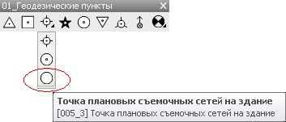
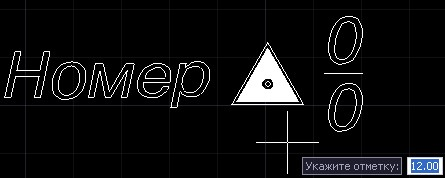
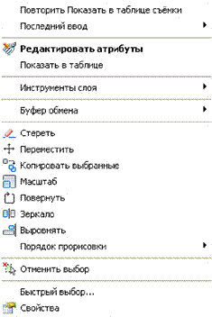
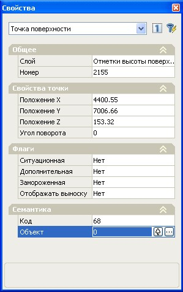
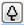
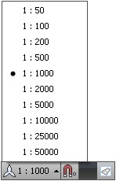

# Вставка точечных условных знаков в ЦММ

При вставке условного знака в **ЦММ** добавляется ситуационная точка с соответствующим стилем отображения. Условный знак неразрывно с ней связан.

**Для вставки точечного условного знака с панели**:

1. Подведите курсор к соответствующей пиктограмме, появится информационная подсказка с указанием наименования условного знака.
   

   Если курсор подвести к соответствующей пиктограмме и задержать его на 1-2 секунды, то появится подробное описание данного условного знака.

2. Щелкните левой кнопкой мыши по пиктограмме, курсор примет форму прицела.
3. Укажите левой кнопкой мыши положение вставляемого условного знака в модели.
4. Условный знак будет вставлен в **ЦММ**. Если он имеет дополнительную семантическую информацию, которая отвечает за его отображение, то она будет автоматически запрашиваться в строке динамического ввода, после вставки знака. К примеру, после указания условного знака **Пункт государственной геодезической сети**, будут последовательно запрошены следующие параметры: отметка, название, отметка центра:

   

Если ввод семантической информации не требуется, то нажмите кнопку **Отмена**. В этом случае, условный знак будет вставлен с параметрами, предусмотренными по умолчанию. При необходимости их потом можно изменить в свойствах данного объекта.

Для подтверждения вводимых в динамической строке параметров условного знака щелкните правой кнопкой мыши.

Точечный условный знак может вставляться как в произвольное место модели (в этом случае вместе с ним будет вставляться ситуационная точка) так и назначаться уже имеющимся точкам **ЦММ**.

Последовательность действий при назначении условного обозначения точке или группе точек **ЦММ** аналогична описанной выше, за исключением:

При выполнении **п.3** нажмите правой кнопкой мыши и из контекстного меню выберите соответствующую опцию:

далее укажите точку, которой необходимо присвоить условное обозначение или выберите ее заранее, а потом воспользуйтесь панелью вставки условного знака.

Часть семантической информации запрашиваемой в строке динамического ввода будет приниматься программой автоматически (например: отметка точки поверхности). Введите недостающую семантическую информацию в динамической строке. Для подтверждения ввода щелкните правой кнопкой мыши.

Точечные условные знаки могут также назначаться точкам поверхности через диалоговое окно **Свойства**. Для этого:

1. Выберите точку или группу точек.
2. Нажмите правую кнопку мыши. Откроется контекстное меню:

   

3. Выберите опцию **Свойства**. После этого появится окно **Свойства**, в котором будут указаны параметры выбранных объектов (ниже представлены параметры точки поверхности), большая часть из них доступна для редактирования:

   

4. В области **Семантика** напротив параметра **Объект** щелкните левой кнопкой мыши по пиктограмме . Откроется библиотека точечных знаков.
5. Откройте в боковой панели библиотеки соответствующую группу, в которой находится искомый условный знак. После выбора группы, все принадлежащие ей условные знаки отобразятся в основном графическом поле библиотеки. Для отображения требуемого условного знака, также можно воспользоваться строкой поиска, расположенной в верхней части библиотеки, введя туда его наименование:

   

6. Выберите нужный условный знак, дважды щелкнув по нему левой кнопкой мыши.

После этого данное условное обозначение будет автоматически присвоено предварительно выбранным точкам **ЦММ**.

Один и тот же условный знак может иметь разные размеры и вид для чертежей с разными масштабами. При вставке условного знака в **ЦММ** за основу принимается текущий масштаб модели, выставленный в соответствующем селекторе, который расположен в статусной строке: 



Данный масштаб влияет только на отображение условных знаков, подписей и прочих элементов плана, размер которых однозначно определяется масштабом создаваемого чертежа. Масштаб может также задаваться в свойствах листа, по которому должен формироваться чертеж.


