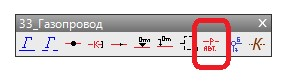

# Подпись характеристик линейных объектов

Имеющийся функционал позволяет исходя из заданных семантических свойств линейного объекта, автоматически сформировать в качестве текстовой строки подпись заданных характеристик.

Для этого:

1. Нажмите кнопку, расположенную на соответствующей панели, с помощью которой был отрисован линейный условный знак:

   

2. Курсор примет форму прицела, выберите линейный объект характеристики которого необходимо подписать. В результате в указанной точке в качестве многострочного текста будет вынесена подпись заданных семантических свойств линейного объекта:
   
   
