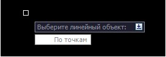
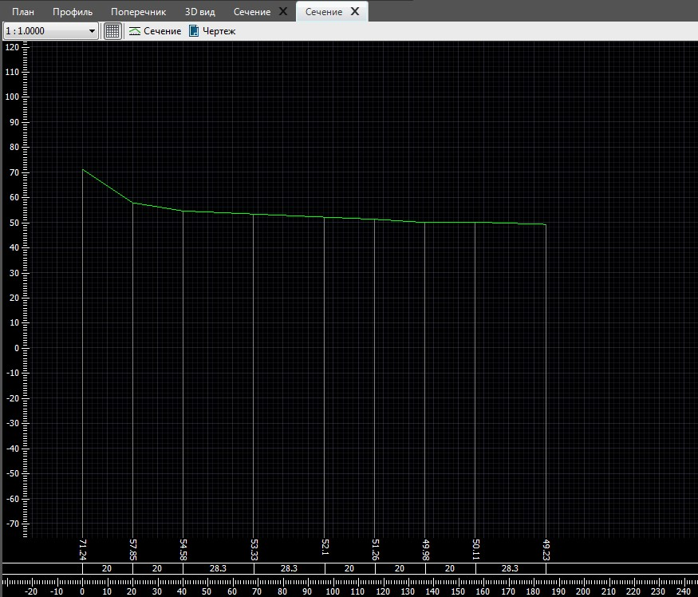
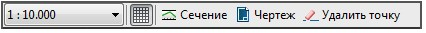
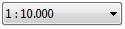
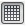
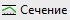
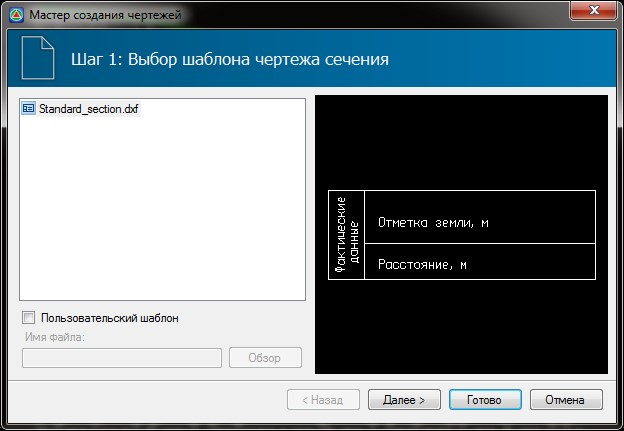
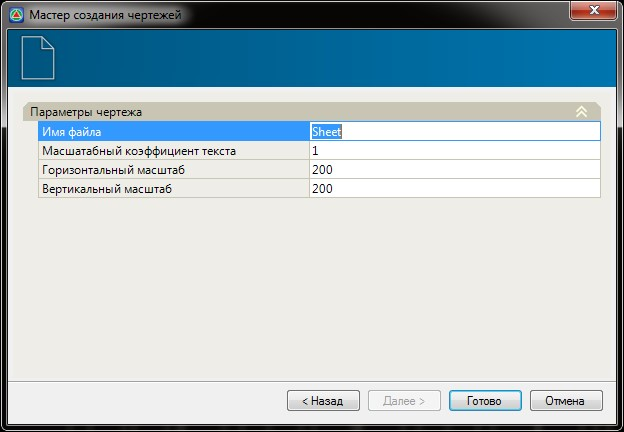
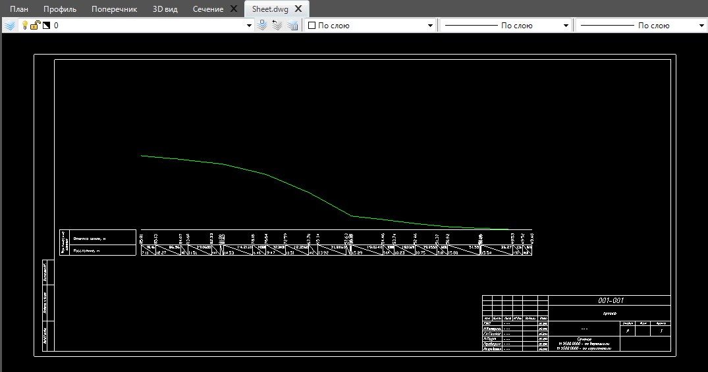
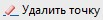

# Создание сечений

Для того, чтобы проверить правильность построения поверхности можно построить ряд сечений (профилей). Также данная функция может быть полезна для создания профиля по коммуникациям.

Для того, чтобы создать сечение:

1. Выберите элемент меню **Поверхность – Создать сечение**.

2. Выберите левой кнопкой мыши линейный объект, вдоль которого будет построено сечение:

   

В результате, программа сформирует сечение и откроет его в дополнительном окне:



1. Линия сечения обновляется динамически при изменении любых данных в области сечения.
2. В сечение по линейному объекту попадают все его точки пересечения с ребрами поверхности, а так же вершины углов поворота линейного объекта. Если в составе линейного объекта присутствует дуга, то программа разбивает дугу на хорды с максимальным отклонением не более величины погрешности заданной в программе. Точки пересечения хорд с дугой так же попадают в сечение.



## Дополнительный функционал во вкладке сечения

Во вкладке сечения имеется возможность настроить отображение линий сечения, корректировать линию сечения путем удаления точек, создать чертеж сечения, а также переназначить другой линейный объект в качестве линии сечения или построить ее указав точки вручную.

Доступный функционал находится на верхней панели окна сечения:

* В селекторе  выбирается отношение вертикального масштаба к горизонтальному.
* С помощью кнопки  производится включение\выключение видимости сетки.
* С помощью кнопки  имеется возможность переназначить другой линейный объект в качестве линии сечения или построить ее указав точки вручную.
* Для создания чертежа сечения нажмите кнопку  . Далее откроется диалоговое окно выбора шаблона чертежа сечения:

  

Выберите стандартный или пользовательский шаблон чертежа сечения и нажмите **Далее**, откроется **Шаг 2**. Настройки основных параметров создаваемого чертежа:

Задайте необходимые параметры и нажмите **Готово**, программа создаст чертеж сечения:

* Для корректировки линии сечения путем удаления узлов нажмите кнопку . Далее курсор примет форму прицела, укажите точки которые необходимо удалить.
