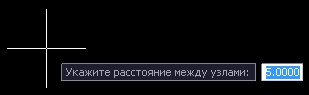

# Сток воды

Для анализа характерных участков поверхности (низины, возвышенности) и визуального отображения направления стока воды используются функции **Динамический сток воды** и **Сток воды в области**.

Функция **Динамический сток воды** позволяет в режиме реального времени в любой точке поверхности показать направление потока воды, для этого:

1. Выберите меню **Поверхность – Анализ - Динамический сток воды**, далее наведите или перемещайте курсор мыши на необходимый участок поверхности, синим цветом будут отображаться линии стока воды с заданной области вокруг курсора:

   

2. Область (радиус) вокруг курсора, с которой рассчитывается сток воды, может быть увеличена или уменьшена с помощью нажатой клавиши **Ctrl** и вращением колесика мыши:

   

Функция **Сток воды** в области позволяет показать направления стока воды с выбранного участка поверхности.

Для этого:

1. Выберите меню **Поверхность – Анализ – Сток воды в области**, курсор примет форму прицела, секущей рамкой выделите область поверхности:

   

2. Далее в строке **Динамического ввода** укажите расстояние между узлами:

   

3. В результате программа отрисует сток воды с выбранной области поверхности:

   



 Меньшее расстояние между узлами приведет к большему их количеству на выделенном участке с которых рассчитывается сток и к более явному и наглядному отображению стока воды, но при больших участках построение может занять больше времени.


