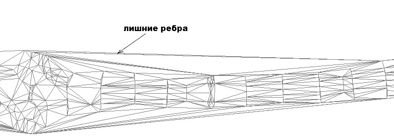

# Перестроить поверхность

Процесс построение треугольников по съемочным точкам с учетом структурных линий называется триангуляцией.

Для того чтобы произвести триангуляцию:

1. Выберите элемент меню **Поверхность – Построения – Перестроить поверхность**.
2. В строке динамического ввода введите максимально возможную длину ребра треугольника, используемую при построении. Для подтверждения щелкните правой кнопкой мыши.

   

   Эта величина должна быть больше расстояния между смежными съемочными точками. Например, при съемке дороги поперечниками с шагом 50м., задание длины ребра 60м. гарантирует успешное окончание процесса триангуляции. Если же длина ребра будет меньше шага, с которым проводилась съемка, то на этих участках поверхность не будет построена:

   

 
 
 Расстояние между смежными точками (51 метр) больше чем максимально заданная длина ребра (45 метров).

При задании очень большой длины ребра, при построении поверхности будут образовываться лишние треугольники, не всегда достоверно описывающие рельеф местности, которые при дальнейшем редактировании ЦММ надо будет удалять:

Задана слишком большая длина ребра, которая приводит к появлению лишних ребер.

После задания максимальной длины ребра запустится процесс построения поверхности. Время триангуляции будет зависеть от объема данных участвующих в построении. В результате, построенная поверхность отобразится в рабочем окне программы.
