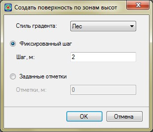
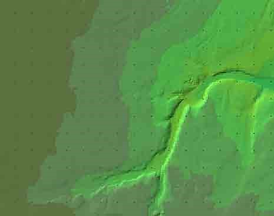

# Создать поверхность по зонам высот

Данная функция позволяет в зависимости от заданного диапазона высот разбить текущую поверхность на области. Каждый участок в зависимости от выбранного стиля градиента будет иметь свой цвет, с помощью которого можно наглядно оценить поверхность (перепады высот), а также узнать площадь каждого участка.

Для этого:

1. Выберите меню **Поверхность – Построения – Создать поверхность по зонам высот**. Откроется диалоговое окно:

   

В зависимости от выбранного **Стиля градиента**, области поверхности будут раскрашены соответствующим набором цветов.

Пример градиента Лес:

В данном окне задаются следующие параметры, используемые для построение поверхности по зонам высот:

**Фиксированный шаг, м**– в данном поле задается шаг, с которым будет разбита поверхность на участки. Например, если задан шаг 5м., то поверхность будет разбита на участки таким образом, что отметки на границах участков будут всегда кратны 5.

**Заданные отметки** – в данном поле могут быть перечислены через разделитель (запятую или пробел) значения высотных отметок, которые будут являться границами участков. Например, если значения высотных отметок точек поверхности распределяются в диапазоне от 100 до 110м., и в поле Отметка ввести значение 102, то программа разобьет поверхность на два участка. В первый участок будут входить все точки поверхности, начиная от 100 и до 102м., во втором от 102 до 110м.

2. Задайте необходимые настройки создания поверхности по зонам высот и нажмите ОК.

3. Откроется диалоговое окно:

   
   
   Введите наименование новой поверхности, которая будет создана на основе текущей поверхности и нажмите **ОК**.

В результате, программа создаст копию исходной поверхности, на которой будут выделены заданные диапазоны высот и сделает ее текущей.
