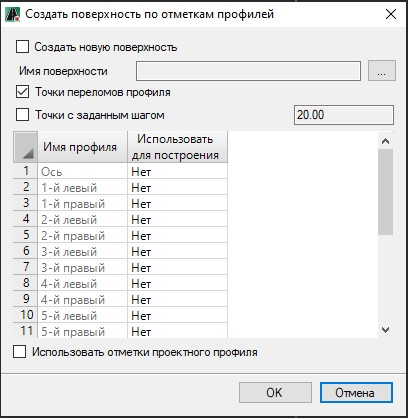

# Построить поверхность по профилям

Данная функция позволяет по данным продольных профилей (фактической и проектной линиям) построить поверхность.

Программа допускает создание поверхности по 19 профилям:

* По оси трассы.
* 8 слева.
* 8справа.
* Левый кювет.
* Правый кювет.

Для этого:

1. Сделайте текущей модель автомобильной дороги, на основании профилей которой будет создана новая поверхность.

2. Выберите меню **Поверхность – Построения – Построить поверхность по профилям**, откроется диалоговое окно:

   

   В данном окне задаются следующие настройки:

* **Создать новую поверхность** - при включении опции будет создана новая поверхность, чтобы перезаписать имеющуюся поверхность нажмите соответствующую кнопку  и выберите из представленного списка необходимую поверхность.
* Чтобы пометить на основании какого профиля из списка будет построена поверхность, выберите параметра **Да** в столбце **Использовать для построения**.
* **Точки переломов профиля** – в зависимости от опции ниже **Использовать отметки проектного профиля**, отметки точек для построения поверхности будут браться с переломов проектной линии (красного профиля) либо с переломов зеленой линии (черного \ фактического профиля).
* **Точки с заданным шагом** - в зависимости от опции ниже **Использовать отметки проектного профиля**, отметки добавляемых точек с шагом будут браться по проектной линии (красному профилю) либо по зеленой линии (черному \ фактическому профилю).

3. Выполните необходимые настройки и нажмите **ОК**.

В результате в плане построится поверхность, которая представляет собой структурную линию с отметками принятыми с указанного профиля.
