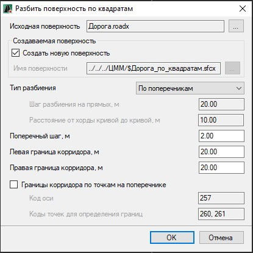

# Построить поверхность по квадратам

Данная функция позволяет построить поверхность на основе исходной поверхности с возможностью добавления дополнительных точек в пределах заданных границ.

Для этого:

1. Выберите меню **Поверхность – Построения – Построить поверхность по квадратам**, откроется диалоговое окно:

   

В данном окне задаются следующие настройки:

  * **Исходная поверхность** – по умолчанию в данном поле указана поверхность текущей модели, для выбора другой модели, на основании данных которой будет построена поверхность, нажмите кнопку .
  * **Создать новую поверхность** – при включении опции будет создана новая поверхность, чтобы перезаписать имеющуюся поверхность нажмите соответствующую кнопку  и выберите из представленного списка необходимую поверхность.
  * **Тип разбиения** – опция, позволяющая построить поверхность по поперечникам или с заданным, в соответствующих полях ввода, шагом разбиения на прямых и криволинейных участках.
  * **Поперечный шаг, м** – в данном поле задаётся расстояние между точками, которые будут созданы относительно оси в пределах заданного коридора.
  * Для определения границ построения поверхности, задаётся **левая** и **правая границы коридора** относительно оси дороги.
  * При необходимости определения границ коридора по точкам на поперечнике, включите соответствующую опцию и задайте **Код оси** и **Коды точек для определения границ**.

    

    Основные стандартные коды узлов на поперечнике представлены в [Приложение Б. Перечень стандартных кодов и переменных конструкций поперечного профиля автомобильной дороги.](../../../../annex/list_standard_codes_and_variable_designs.md).

    

2. Задайте необходимые настройки и нажмите **ОК**.

В результате в **Структуре проекта** появится дополнительная папка **ЦММ**, в которой отобразится модель с поверхностью созданной согласно выполненным настройкам.
