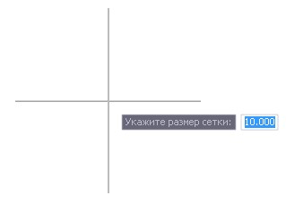
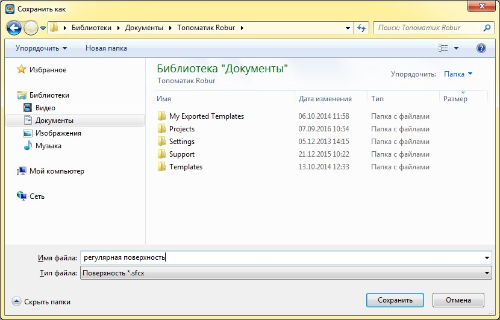

# Создать регулярную поверхность

Данная функция позволяет создать регулярную поверхность на основе исходной.

Для этого:

1. Выберите элемент меню **Поверхность – Утилиты – Создать регулярную поверхность**.
2. В строке динамического ввода укажите размер сетки регулярной поверхности:
   
   

3. В окне **Сохранить как** задайте наименование файла регулярной поверхности:
   
   



Для дальнейшей работы с созданной регулярной поверхностью, она может быть добавлена в текущей проект с помощью функции **Импортировать-Поверхность** или **Добавить существующую ЦММ**.


