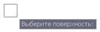
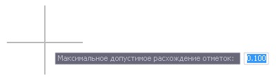
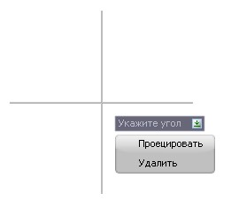

# Зоны перекрытия поверхностей

Данная функция может использоваться для стыковки двух смежных ЦММ имеющих наложение на участке их совмещения.

Для этого используется отображение зон перекрытия, а также рабочих отметок в зоне совмещения поверхностей с возможностью их корректировки.

Для этого:

1. Сделайте текущей поверхность, отметки которой необходимо отредактировать.

2. Выберите элемент меню **Поверхность – Утилиты – Зоны перекрытия поверхностей**, курсор примет форму прицела, укажите другую поверхность:

   

3. В строке динамического ввода задайте максимальное допустимое расхождение и нажмите **Enter**.

   

   

   Расхождение отметок определяется в точке каждой поверхности, путем ее проецирование на треугольник смежной поверхности.

   

   В результате, отобразится зона перекрытия, а также расхождение отметок по обоим поверхностям:

   

   

   1. Отметки текущей поверхности, которые превышают заданное расхождение, отображаются ярко красным цветом (положительная рабочая отметка) и синим цветом (отрицательная рабочая отметка).
   2. Бледно синим и бледно красным цветом отображены отметки другой (не текущей поверхности), которые не попали в допуск.
   3. Рабочие отметки, не превышающие допуск, отображены белым цветом.

   

4. Отметки в зоне совмещения могут быть отредактированы, для этого имеется возможность удаления точек и проецирования их на выбранную поверхность.

   Нажмите левой кнопкой мыши на отметку и в открывшемся контекстном меню выберите соответствующую опцию:

   

   

   Для того что бы отредактировать отметки соседней поверхности (которые раскрашены бледно синим и бледно красным цветом), её необходимо сделать текущей и повторить описанные выше пункты.

   

5. Для выхода из режима редактирования поверхности с помощью отображения совмещенной зоны щелкните правой кнопкой мыши.
