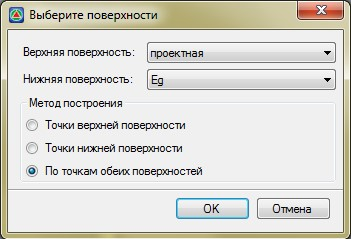
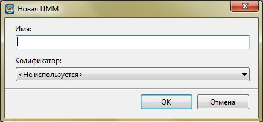

# Разность поверхностей

Данная функция предназначена для создания поверхности по разности двух исходных поверхностей. К примеру, она может быть построена по рабочим отметкам между проектной и существующей поверхностью.

Для этого:

1. Выберите меню **Поверхность – Построения – Разность поверхностей**, откроется диалоговое окно:

   

В данном окне задаются следующие настройки, используемые для создания новой поверхности:

* **Верхняя поверхность** – в данном выпадающем списке представлен набор поверхностей, которые содержит текущий проект. Необходимо выбрать поверхность, которая будет считаться верхней.

* **Нижняя поверхность** - в данном выпадающем списке представлен набор поверхностей, которые содержит текущий проект. Необходимо выбрать поверхность, которая будет считаться нижней.

   Методы построения разности поверхности:

* **Точки верхней поверхности** - построенная поверхность будет состоять из рабочих отметок, полученных путем разности отметок верхней и нижней поверхности, вычисленных в точках верхней поверхности.
* **Точки нижней поверхности** - построенная поверхность будет состоять из рабочих отметок, полученных путем разности отметок верхней и нижней поверхности, вычисленных в точках нижней поверхности.
* **Точки обеих поверхностей** - построенная поверхность будет состоять из рабочих отметок, полученных путем разности отметок верхней и нижней поверхности, вычисленных в точках, какверхней,так и нижней поверхности.

   

   Наиболее точным методом построения разности поверхностей является метод – По точкам обеих поверхностей.

   

2. Задайте необходимые настройки создания разности поверхностей и нажмите **ОК**.

3. Откроется диалоговое окно:

   

4. Введите наименование новой поверхности, которая будет создана на основе двух исходных поверхностей, по рабочим отметкам между ними и нажмите **ОК**.

В результате, программа создаст новую поверхность. При необходимости ее высотные области могут быть выделены отдельными цветами. Для этого используется функция [**Создать поверхность по зонам высот**](construction_surface_across_zone_heights.md).
