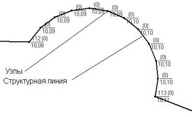

# Редактирование поверхности

Если после триангуляции на поверхности имеются участки, очертание которых не соответствует реальному рельефу местности, то такие участки могут быть отредактированы дополнительно. Редактирование ЦММ заключается, как правило, в добавлении дополнительных рельефных точек и структурных линий, изменении свойств уже имеющихся точек поверхности и ограничивающих контуров, изменении направления диагональных ребер (данное ребро является общим у двух смежных треугольников образующих параллелограмм).

Добавление дополнительных точек производится, когда в существующей съемке недостаточно точек для корректного описания рельефа. Например, на кривой малого радиуса отсняты только точка начала, середины и конца закругления. Для предания структурной линии плавного очертания в нее может быть добавлено несколько дополнительных узлов:

Дополнительные структурные линии вводятся на участках имеющих резкие изломы (обрывы, границы искусственных сооружений, бордюрные камни) в результате чего меняется форма рельефа.

Для ввода, редактирования дополнительных точек и структурных линий можно в полной мере использовать функционал, описанный в соответствующих разделах данного руководства.
