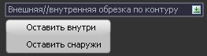

# Вырезать поверхность по замкнутому контуру

С помощью данной функции можно в указанном контуре вырезать участок поверхности. Это удобно, например, при внесении корректировки в поверхность, когда необходимо переделать какую - то область поверхности.

Для этого:

1. Создайте замкнутый контур (с помощью полилинии, структурной линии и т.д.).
2. Выберите меню **Поверхность – Утилиты – Вырезать поверхность по замкнутому контуру**, курсор примет форму прицела.
3. Выберите необходимый контур и в строке динамического ввода напишите название новой модели, затем нажмите **ENTER**, после укажите способ обрезки поверхности:

   

* **Оставить внутри** – в новую модель **ЦММ** будет вырезана часть поверхности, которая находится внутри выбранного контура.
* **Оставить снаружи** - в новую модель **ЦММ** будет вырезана часть поверхности, которая находится снаружи выбранного контура.



Примитивы, попавшие в границы контура, так же будут обрезаны.



В результате, в структуре проекта добавится дополнительная папка **ЦММ**, в которой отобразится модель с обрезанной поверхностью и примитивами.
