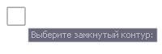
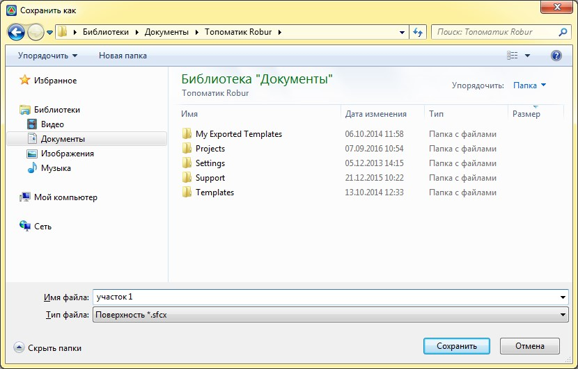

# Разделить поверхность

Данная функция позволяет разделить ЦММ на части и используется, к примеру, для разделения работ между исполнителями (при создании больших поверхностей) или замены некорректного участка поверхности.



Вырезке, на данный момент подлежат точки и треугольники. не вырезаются ситуационные объекты (площадные, линейные знаки, полилинии и т.п.).



Для этого:

1. Выберите элемент меню **Поверхность – Утилиты – Разделить поверхность**.
2. Курсор примет форму прицела, выберите линейный объект:

   

   

   Предварительно должен быть нарисован **ЗАМКНУТЫЙ** контур. Если контур вырезки ситуационная линия, то вырезаются только точки. Для вырезки треугольников необходимо в качестве контура вырезки использовать ограничивающую структурную линию.

   

3. В результате выделенная область сохраняется в отдельный файл. В окне **Сохранить как**, задайте наименование файла вырезанного участка поверхности:

    



Для дальнейшей работы с данным участком поверхности, он может быть добавлен в текущей проект с помощью функции **Импортировать-Поверхность** или **Добавить существующую ЦММ**.


