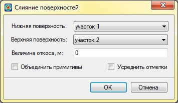
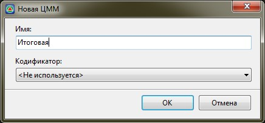

# Слияние поверхностей

Данная функция предназначена для объединения двух поверхностей, как правило, проектной и существующей поверхности, или двух смежных участков имеющих наложение.

Для этого:

1. Сделайте текущей модель ЦММ.

2. Выберите меню **Поверхность – Построения – Слияние поверхностей**, откроется диалоговое окно:

   

   В соответствующих выпадающих списках выберите поверхности которые необходимо объединить.

   

   Верхняя поверхность является приоритетной и под ней треугольники нижней поверхности будут удалены.

   

   **Величина откоса** - это размер области вокруг Верхней поверхности, внутри которой треугольники нижней поверхности будут удалены, а далее данная область будет перетриангулирована. Поэтому, большее значение величины откоса сделает слияние поверхностей с более пологим откосом, а меньшее соответственно с более крутым.

   Для того чтобы произвести объединение примитивов двух поверхностей включите опцию **Объединить примитивы**, в противном случае объединены будут только элементы поверхностей.

   Для того чтобы в зоне пересечения (слияния) смежных поверхностей отметки точек усреднились (фактическая отметка точки усредняется с отметкой смежной поверхностью под ней) включите опцию **Усреднить отметки**.

3. Задайте необходимые параметры и нажмите **ОК**, откроется диалоговое окно:

   

4. Введите название объединенной поверхности и нажмите **ОК**. В результате будет создана объединенная поверхность.
