# Настройки

В данном окне задаются настройки текущей модели **ЦММ**.

Окно **Настройки поверхности** можно вызвать двумя способами:

1. Выберите в основном меню **Поверхность – Настройки**.
2. В окне **Структура проекта** щелкните правой кнопкой мыши по модели поверхности и выберите из появившегося контекстного меню пункт **Настройки**.

   

   Для задания настроек по умолчанию для вновь создаваемых моделей, а также общих настроек проекта, воспользуйтесь элементом меню **Сервис - Настройка**.

   

## Общие настройки

В диалоговом окне выберите пункт **Общие**:

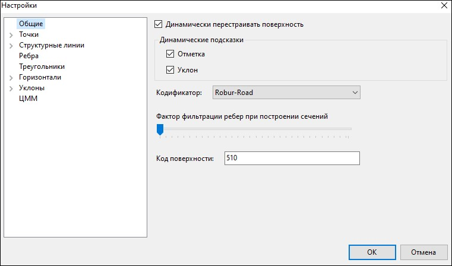

* **Динамически перестраивать поверхность** – по умолчанию данная опция включена и при внесении любых изменений в текущую модель **ЦММ** (например, изменение высотной отметки точки, построение дополнительной структурной линии и т.д.) поверхность будет перестраиваться автоматически. Если данная опция отключена, то поверхность необходимо перестраивать вручную, путём выбора соответствующей функции (например, **Поверхность – Построения – Перестроить поверхность**).
* **Динамические подсказки** – если динамические подсказки **Отметка** и **Уклон включены**, то во всплывающем окне, возле курсора, отображается динамически обновляемая информация (отметка и уклон):

  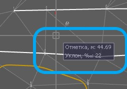

Если какая-то из опций отключена, то во всплывающем окне, возле курсора, она отображаться не будет.

* **Кодификатор**-
* **Фактор фильтрации рёбер при построении сечений**-
* **Код поверхности** – строка ввода, предназначенная для задания кода поверхности. Этот код является уникальным признаком для поверхности, в результате чего при наличии в проекте нескольких поверхностей, по данному признаку их можно отличить друг от друга и использовать в разных задачах. Например, для формирования ведомости между двумя поверхностями или, например, для получения отметок и уклонов на поперечнике по определенной линии поверхности.

## Настройка отображения точек

В диалоговом окне выберите пункт **Точки**, далее раскройте дерево объектов и выберите:

### Стиль точек

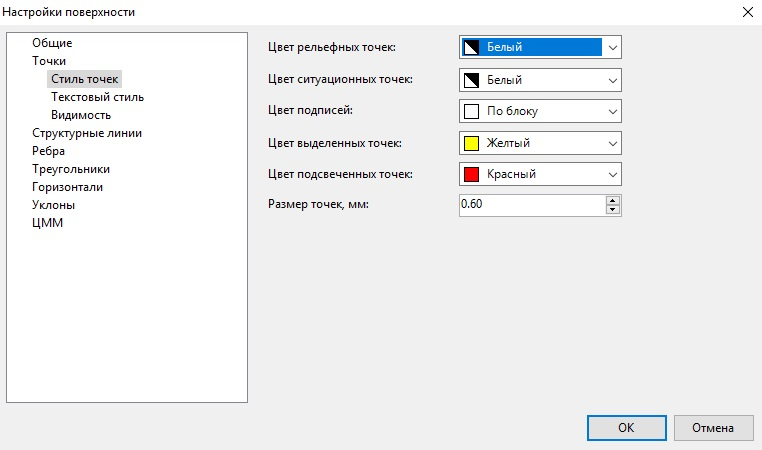

* Это группа элементов, которая содержит опции для настройки стиля отображения и размера точек на плане.
* Из соответствующих выпадающих списков можно выбрать цвет рельефных, ситуационных и дополнительных точек, цвет подписей и цвет выделенных, подсвеченных точек.
* **Размер точек** - отображения точек на плане определяется величиной диаметра окружности .

### Текстовый стиль

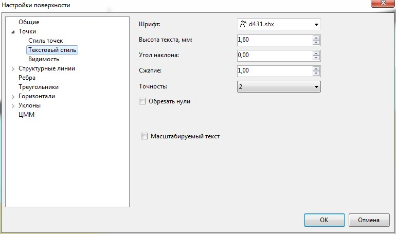

* В этой группе элементов можно настроить параметры текстовых подписей (**Шрифт, Высота текста, Угол наклона** и **Сжатие**), которые по умолчанию применяются ко всем точкам плана. В данной группе также задается точность – количество знаков после запятой при отображении точек на плане.
* **Обрезать нули** – включенная опция позволяет на подписях точек, скрыть конечные нули в дробной части числа. Например, имеется точка с отметкой 3.250, точность после запятой выставлена до третьего знака, при активной опции программа скроет конечный ноль, в результате получится отметка 3.25.
* Опция **Масштабируемый текст** позволяет автоматически менять размер точек и их подписей (уменьшать или увеличивать) при изменении масштаба изображения модели на экране.

### Видимость

* В поле **Отображать точки** задается, какие точки (ситуационные, рельефные или дополнительные) будут видимыми на плане. Установив опции **Отметки, Номера, Коды** или **Описание**. Пользователь может включить видимость соответствующих свойств точки в графическом поле программы.
* Если выбрана опция **Отображать условные знаки**, то в соответствующих точках отображаются назначенные им условные знаки согласно текущему кодификатору.
* Опция **Маскировка отметок точек** предназначена для создания маски в форме прямоугольника вокруг текста точки, чтобы под текстом не были видны элементы поверхности (горизонтали, структурные линии, треугольники и т.д.) и условные знаки топографического плана:

  

* **Коэффициент перекрытия** – если коэффициент равен 1, то размер маскировки вокруг текста будет соответствовать размеру текста. Если коэффициент равен 1,5, то фон будет выступать за пределы текста на половину его высоты.



Управление видимостью элементов точек текущей модели поверхности может быть осуществлено с помощью соответствующей кнопки на панели управления в нижней части рабочего окна:

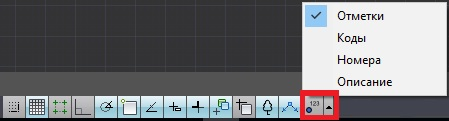

Нажав на треугольник рядом с кнопкой, в выпадающем списке отметьте галочками какие элементы точек должны отображаться. Нажав кнопку, можно быстро включить\выключить отображение отмеченных элементов точек.



## Настройка отображения структурных линий

В диалоговом окне выберите пункт **Структурные линии**, далее раскройте дерево объектов и выберите:

### Стиль

Из выпадающих списков можно выбрать **Цвет ограничивающих** структурных линий и **Цвет ситуационных** структурных линий.

Варианты задания цветов:

* **По слою** – выбрав данную настройку, структурным линиям будет присваиваться цвет согласно настройкам слоя.
* **По блоку** – выбрав данную настройку, структурным линиям будет присваиваться цвет назначенного семантического объекта в **Менеджере структуры семантики**:

   

   

   Подробное описание работы с семантическими объектами представлено в разделе **Менеджер структуры семантики(Объектный кодификатор)**.

   

* **Путем присвоения цвета** – выбор цвета структурной линии из представленной палитры цветов.

## Настройка отображения ребер

В диалоговом окне выберите пункт **Ребра**:

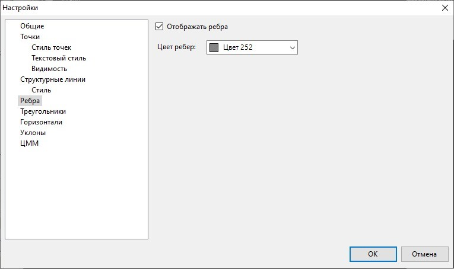

* **Отображать ребра** – при установке данной опции будут показаны ребра треугольников, это удобно при редактировании ЦММ (создание групп, поворот ребер и т.п.). Цвет их отображения может быть выбран из стандартной палитры, в поле **Цвет ребер**.

## Настройка отображения треугольников

В диалоговом окне выберите пункт **Треугольники**:

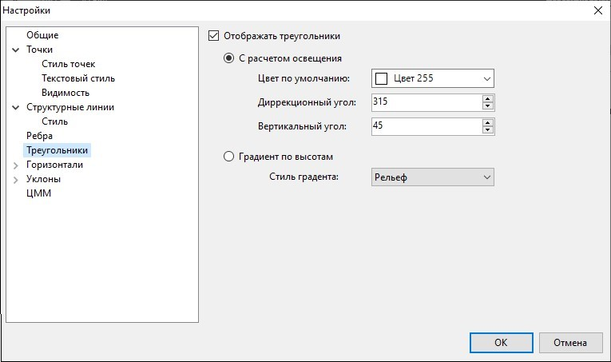

* **Отображать треугольники** – позволяет отображать грани треугольников в соответствии с выбранным стилем, возможны два варианта:

1. **C расчетом освещения** - В этом случае необходимо выбрать цвет фона из стандартной цветовой палитры и положение источника освещения, которое задается дирекционным углом относительно северного направления и вертикальным углом относительно горизонтальной плоскости. В результате, треугольники, направленные на источник будут отображаться более светлыми оттенками, а те на которые освещение не попадает, будет более затемнены.

   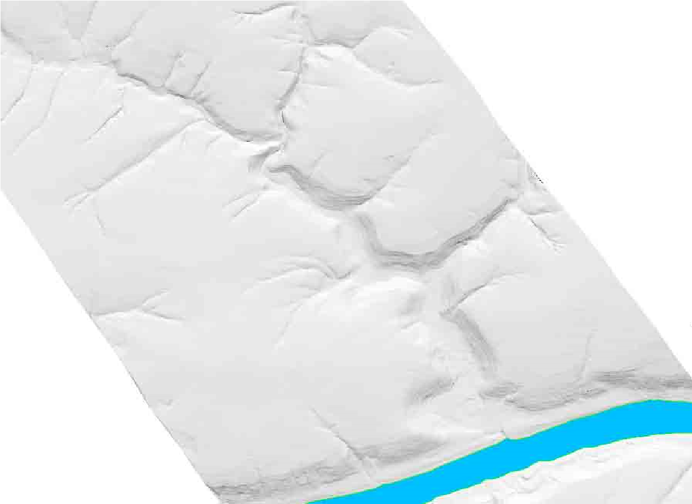

2. **Градиент по высотам** - в этом случае выбирается стиль градиента. Каждому стилю может соответствовать определенный цвет или набор цветов. Треугольники на различных участках будут иметь цвет, в зависимости от того в какой диапазон высот они попадают. Благодаря этому, можно быстро выявлять на поверхности пониженные (повышенные) места, участки резкого изменения рельефа и пр.

   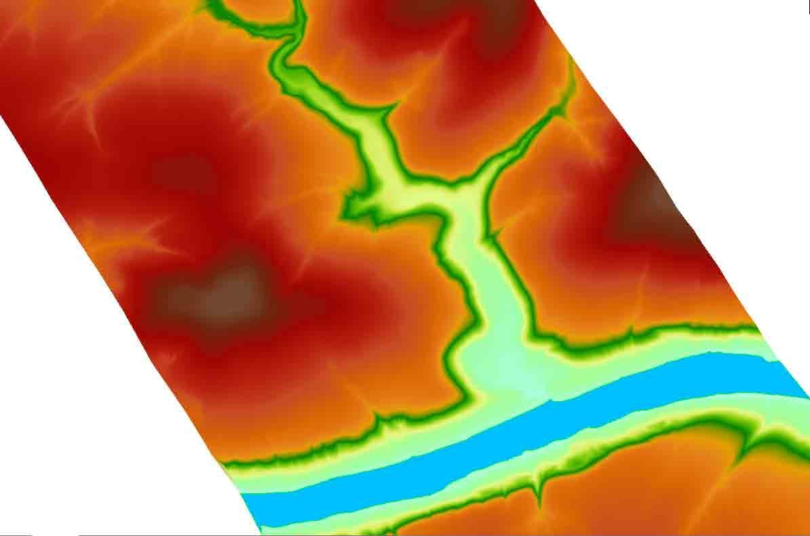

## Настройки отображения горизонталей

В диалоговом окне выберите пункт **Горизонтали**, далее раскройте дерево объектов и выберите:

### Стиль горизонталей

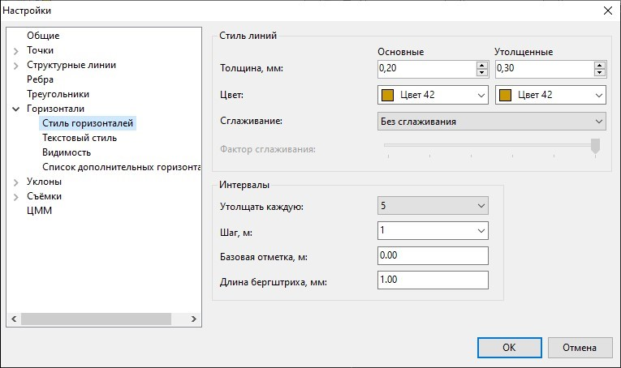

* **Стиль линий** – в этой группе элементов устанавливается толщина основных и утолщённых горизонталей, из раскрывающейся палитры цветов можно выбрать цвет горизонталей, тип сглаживания (горизонтали могут отрисовываться полилиниями или в виде В-сплайнов), а также фактор сглаживания горизонталей.
* **Интервалы** – в данном поле задается шаг основных и утолщенных горизонталей, длина бергштриха и базовая отметка, от которой будут считаться горизонтали.

### Текстовый стиль

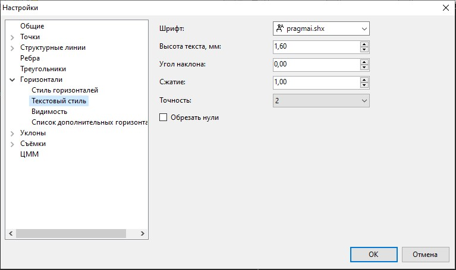

* **Стиль текста** – в этой области задается шрифт и размер подписи основных и утолщенных горизонталей, а также точность отображения отметок.
* **Обрезать нули** – включенная опция позволяет на подписях горизонталей, скрыть конечные нули в дробной части числа. Например, имеется горизонталь с подписью 207.540, точность после запятой выставлена до третьего знака, при активной опции программа скроет конечный ноль, в результате горизонталь будет подписана как 207.54.

### Видимость

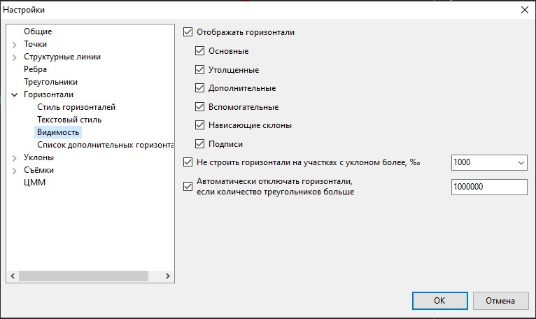

* **Отображать горизонтали** – включается/выключается видимость различных видов горизонталей и подписей к ним.
* **Не строить горизонтали на участках с уклоном более** – данная функция позволяет автоматически скрывать горизонтали на участках с уклоном более заданного. Данная функция скрывает горизонтали на бортовых камнях, подпорных стенках и т.д.
* **Автоматически отключать горизонтали, если количество треугольников больше** - данная опция позволяет ускорить работу с большими поверхностями, путём автоматического отключения видимости слоя Горизонтали в момент любого пересчета поверхности (например, при удалении точки, изменения ее отметки и т. д.).

### Дополнительные горизонтали

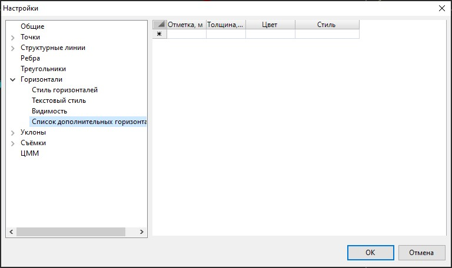

Описание одной горизонтали занимает одну строку.

* В столбце **Отметка** задается отметка новой горизонтали.
* В столбце **Толщина** задается толщина дополнительной горизонтали.
* В столбце **Цвет** из раскрывающейся палитры цветов можно выбрать цвет дополнительных горизонталей.
* В столбце **Стиль** задается тип дополнительной горизонтали (**Дополнительная, Вспомогательная, Нависающий уклон**). В зависимости от выбранного типа будет меняться отображение горизонтали на плане:

  

## Настройка отображения уклонов

Для большей наглядности при чтении рельефа, помимо заливок и горизонталей можно отображать уклоны треугольников. Уклонами показывается направление наискорейшего спуска воды.

В диалоговом окне выберите пункт **Уклоны**, далее раскройте дерево объектов и выберите:

### Стиль стрелок

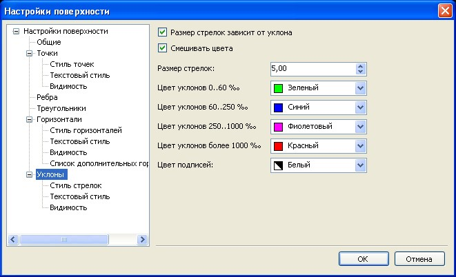 

Группа элементов Стиль стрелок позволяет настроить цвет отображения стрелок, для каждого диапазона уклонов, выбирая из соответствующих выпадающих списков.

* Если опция **Размер стрелок зависит от уклона** не установлена, то размер стрелки задается в поле **Размер стрелок**, в единицах чертежа. Когда данная опция установлена, то размер стрелки будет рассчитываться динамически, в зависимости от величины уклона треугольника. В этом случае, в поле **Размер стрелки** задается не ее абсолютное значение, а некий коэффициент соотношения значения длины стрелки от величины уклона.
* **Смешивать цвета** - если данная опция отключена, то цвета стрелок отображаются в зависимости от цвета заданного каждому диапазону уклонов. Если опция включена то происходит смешение цветов и в зависимости от того на сколько больше величина уклона приближается к следующему диапазону, на столько больше будет преобладать цвет следующего диапазона.

### Текстовый стиль

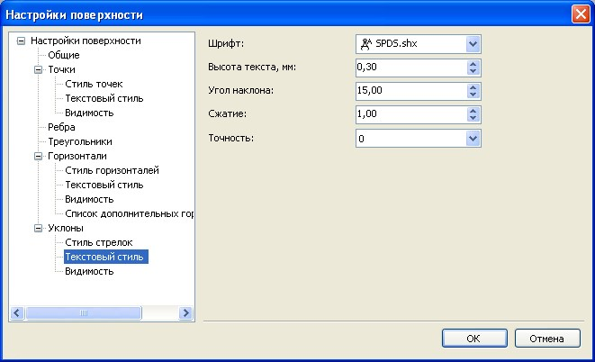

* В группе элементов **Текстовый стиль** можно настроить параметры подписи (**Шрифт, Высота текста, Угол наклона и Сжатие**), которые по умолчанию применяются к подписям уклонов. В данной группе также задается точность – количество знаков после запятой при отображении значения уклонов на плане.

### Видимость

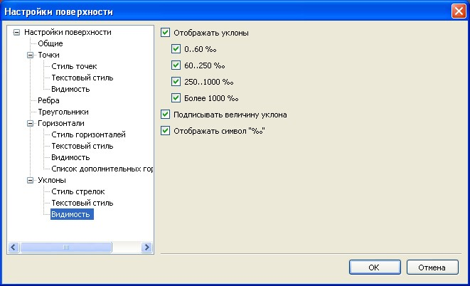

* Для отображения уклонов поставьте галочку напротив опции **Включить отображение уклонов**.
* Имеется возможность отрисовывать уклоны не на всех треугольниках, а только тех, которые попадают в заданный числовой диапазон. Для этого выберите необходимые диапазоны уклонов, поставив галочки напротив нужных групп.
* Если включена опция **Подписывать величину уклона**, то рядом с уклоноуказателем будет подписываться его числовое значение. Значения уклонов подписываются в промилле. При установлении опции **Отображать символ**, рядом с числовым значением будет отрисовываться соответствующий условный знак.

## Настройка ЦММ

Данный раздел настроек используется при проектировании площадных объектов.

На вкладке **ЦММ** представлены следующие настройки:

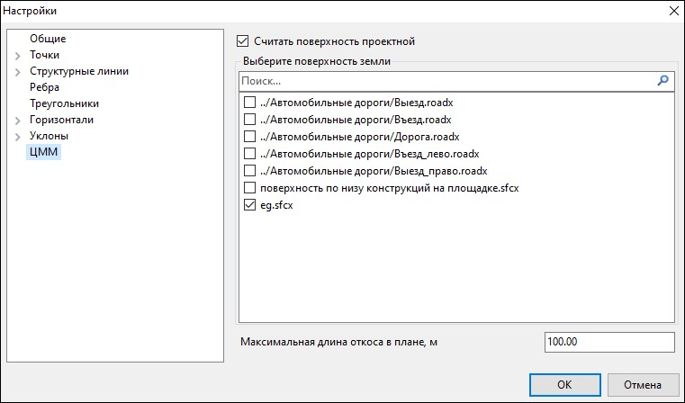

* **Считать поверхность проектной** – при активной опции текущая модель будет считаться проектной поверхностью.
* **Выберите поверхность земли** – указываются поверхности, которые будут являться фактическими для проектного площадного объекта. Например, при построении откосов площадки с помощью данной настройки выбирается поверхность, до которой будет строиться откос.
* **Максимальная длина откоса в плане, м** – по умолчанию максимальная длина откоса в плане составляет 100 м. Данная настройка задаётся, как в качестве ограничения (например, чтобы при построении откос не выходил за пределы поверхности), так и в качестве увеличения его максимальной длины (например, при проектировании глубоких карьеров с длинными откосами).
