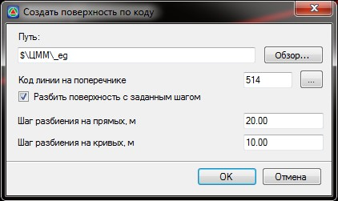

# Поверхность по коду

Функция позволяет создать поверхность по выбранному коду (линии с кодом) на поперечнике и необходимым шагом разбиения на прямых криволинейных участках. К примеру, эта функция может использоваться когда требуется создать поверхность по черным поперечникам или какому-либо конструктивному слою дорожной одежды.

Для этого:

1. Выберите меню **Поверхность - Построения - Поверхность по коду**, откроется диалоговое окно:

   

   **Путь** - поле ввода предназначенное для выбора или создания новой модели поверхности и места сохранения созданной ЦММ.

   **Код линии на поперечнике** - поле ввода предназначенное для выбора кода линии, по которой будет построена поверхность. Для выбора кода линии из списка имеющихся, нажмите кнопку

   **Разбить поверхность с заданным шагом** - опция, позволяющая построить поверхность с заданным в соответствующих полях ввода шагом разбиения на прямых и криволинейных участках.

2. Задайте необходимые настройки создания поверхности и нажмите **ОК**.

В результате программа построит поверхность по данным поперечника и сделает ее текущей.
