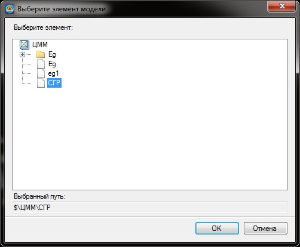
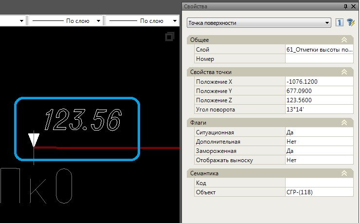

# Поверхность по СГР

В случае проекта ремонта или реконструкции железных дорог, когда в качестве черного профиля является профиль по СГР (существующей головке рельса), имеется возможность вынести отметки с данного профиля в качестве ситуационных точек с соответствующими условными знаками.

Для этого:

1. Выберите меню **Поверхность - Построения - Поверхность по СГР**, откроется диалоговое окно выбора элемента модели, в которую будут добавлены точки:
   
   

2. Выберите необходимую модель и нажмите **Ок**. В результате, в выбранную модель поверхности будут добавленные ситуационные точки с соответствующими условными знаками:
   
   
