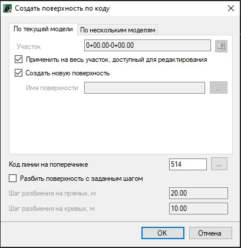
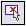
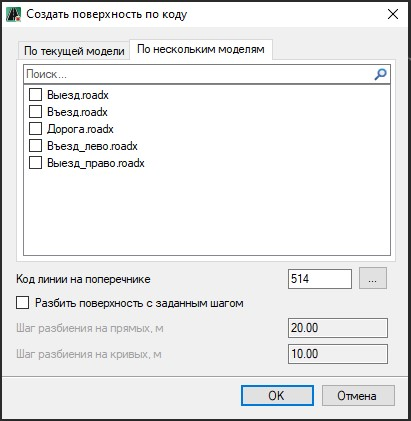

# Поверхность по нескольким линиям с кодом

Функция позволяет создать поверхность по нескольким линиям с одинаковыми кодами на поперечнике. Например, для корректного построения поверхностей по выравнивающим/основным слоям при фрезеровании.

Для этого:

1. Выберите меню **Поверхность – Построения – Поверхность по нескольким линиям с кодом**, откроется диалоговое окно:

   

   

   Сделайте текущей модель автомобильной дороги, на основе линий которой будет создана поверхность.

   

   В данном окне представлены следующие настройки:

  * **Применить на весь участок, доступный для редактирования** – по умолчанию поверхность будет создана на протяжении всего участка, при отключении данной опции появится возможность указать участок, на протяжении которого будет создана поверхность. Участок можно задать непосредственно в поле ввода или указать графически при помощи соответствующей кнопки .
  * **Создать новую поверхность** – при включении опции будет создана новая поверхность, чтобы перезаписать имеющуюся поверхность нажмите соответствующую кнопку  и из представленного списка выберите необходимую поверхность.
  * **Код линии на поперечнике** - поле ввода предназначено для задания кода линии, по которому будет построена поверхность. Для выбора кода линии из списка имеющихся нажмите кнопку .
  * **Разбить поверхность с заданным шагом** - опция, позволяющая добавить дополнительные точки с заданным, в соответствующих полях ввода, шагом разбиения на прямых и криволинейных участках.

    

    При необходимости создания поверхности по нескольким моделям выберите соответствующую вкладку и включите те модели, на основе, которых будут созданы поверхности:

    

   

2. Задайте необходимые настройки и нажмите **ОК**.

В результате в **Структуре проекта** появится дополнительная папка **ЦММ**, в которой отобразится модель с созданной поверхностью по линиям с кодом.
