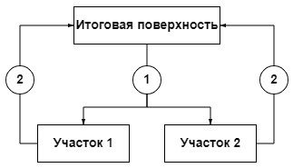
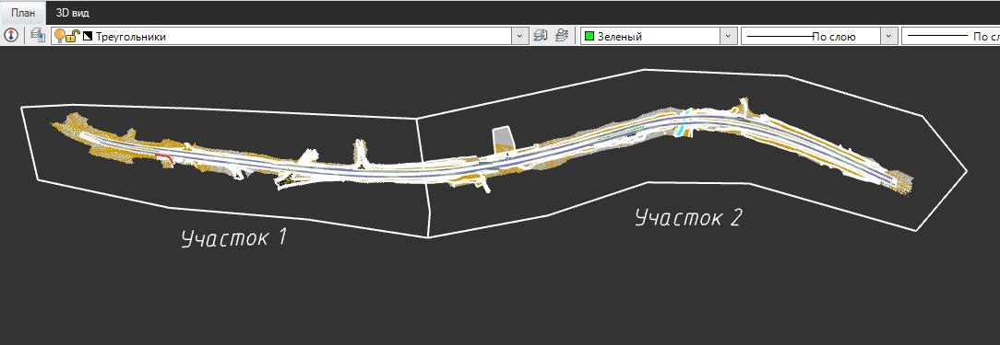
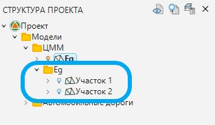
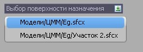

# Совместная работа

Совместная работа над моделью **ЦММ** подразумевает возможность единовременно несколькими исполнителями (каждый на своём участке) создавать и редактировать цифровую модель местности и обрабатывать материалы полевых изысканий. Для этого поверхность делится на участки. Каждый участок представляет собой отдельную поверхность и внесённые изменения в ней синхронизируются с итоговой поверхностью. Ниже условно представлена схема совместной работы двумя исполнителями над одной поверхностью:

* 1 – Разбивка поверхности на участки.
* 2 – Передача информации участка в итоговую модель.

Совместная работа с поверхностью делится на два этапа:

**I.** Подготовка исходных данных.

**II.** Отправка данных с участка в итоговую модель.

**Этап I. Подготовка исходных данных.**

Подготовка исходных данных включает в себя разбивку поверхности на участки.

Для этого:

1. Выбрав функцию из меню **Поверхность – Структурные линии – Ввести**, создайте замкнутые контуры, которые будут являться границами участков:

   

   

   Важно, чтобы структурная линия на границе участков проходила через съёмочные точки и имела свойство **Ограничивающая**.

   

2. Выберите меню **Поверхность – Совместная работа – Разбить на участки**, укажите замкнутую структурную линию (контур участка), после, введите название новой модели (например, Участок 1).

3. Нажмите **ENTER.**

   

   Для создания дополнительных участков повторите пункты 1,2,3.

   

В результате в **Структуре проекта** будет создана дополнительная папка с названием итоговой поверхности (например, Eg). В этой папке будут созданы дополнительные модели (например, Участок 1 и Участок 2 и т.д.), каждая из которых определяет один участок, на котором исполнитель может выполнять необходимые виды работ (например, создание и редактирование цифровой модели местности, оформление топографического плана и т.д.):

**Этап II. Отправка данных с участка в итоговую модель.**

После того, как на участках выполнены необходимые корректировки, их нужно синхронизировать с итоговой поверхностью. Это необходимо для того чтобы выполненная работа отобразилась в итоговой поверхности.

Для этого:

* Сделайте измененную модель поверхности текущей.
* Выберите меню **Поверхность – Совместная работа – Отправить изменения**, далее выберите замкнутую структурную линию (контур участка) и поверхность назначения (итоговую поверхность):

  

В результате, изменения, сделанные на текущем участке, будут отправлены в итоговую поверхность и отобразятся в ней.



После того как коллективная работа над поверхностью завершена, и все данные участков были синхронизированы с итоговой поверхностью, дополнительные участки могут быть удалены из проекта.


