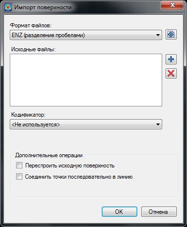
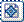
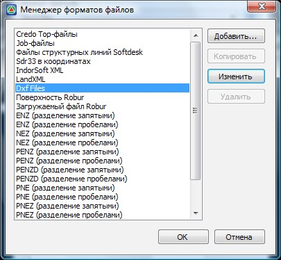
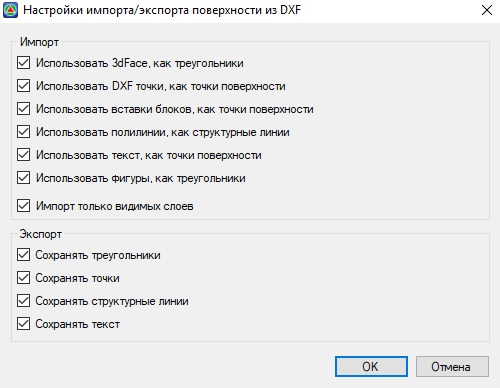

# DXF

**{{robur}}** позволяет импортировать **DXF**-файл, состоящий из точек, блоков, полилиний, и примитивов **3Dface** (треугольников).

Для импорта из **dxf**-файла:

1. Выберите элемент меню **Поверхность- Импорт/Экспорт - Импорт поверхности**, появится следующие диалоговое окно:

   

2. В поле **Формат файлов** из выпадающего списка выберите **Dxf Files**.

3. Укажите импортируемый файл, нажав кнопку . Путь к загружаемому файлу отображается в поле **Исходные файлы**.

   

   Все опции данного диалогового окна были описаны в предыдущем разделе ([Текстовый файл](txt.md)).

   

4. Нажмите **Ок**.

В результате произойдет загрузка данных, и они отобразятся в рабочем окне.



 Если при загрузке программа выдала сообщение об ошибке или данные загрузились не корректно, необходимо детально проверить установленные настройки импорта данных из dxf-файла.



Для этого:

Щелкните левой кнопкой мыши на пиктограмме  поля формат файлов, откроется следующие диалоговое окно:

Для того, чтобы проверить или модифицировать установленные настройки импорта из dxf-файла, выберите данный тип из списка и нажмите на кнопку **Изменить**.

Откроется окно **настроек импорта/экспорта**:

В данном диалоговом окне можно установить необходимые настройки импорта/экспорта данных соответственно в/из **{{robur}}**:

**Использовать 3dFace, как треугольники** – если данная опция установлена и импортируемый файл содержит примитивы **3dFace**, то при загрузки их в **{{robur}}**, они будут распознаваться как грани треугольников.

**Использовать Dxf точки, как точки поверхности** - Трехмерные точки загружаются как точки поверхности с соответствующими координатами X,Y,Z.

**Использовать полилинии как структурные линии** - При использовании данной опции, полилинии чертежа будут загружаться в {{robur}} в виде структурных линий. В узлах структурной линии будут автоматически вставлены точки, отметки которых будут равны отметкам вершин импортируемой полилинии.

**Использовать текст, как точки поверхности** – В виде точек поверхности могут подгружаться не только трехмерные точки, но и подписи отметок, т.е. текстовые примитивы. В этом случае, координаты точки привязки текста принимаются как координаты съемочной точки, а текстовое значение как высота.



 При импорте данных из dxf-файла, слои с примитивами, не относящимися к ЦММ (коммуникации, подписи, условные обозначения) должны быть выключены.



**Сохранять треугольники** - при экспорте поверхности из **{{robur}}** в dxf-файл треугольники будут сохраняться как примитивы 3dFace.

**Сохранять точки** - при экспорте поверхности из **{{robur}}** в dxf-файл точки поверхности будут сохраняться как примитивы трехмерные точки.

**Сохранять структурные линии** - при экспорте поверхности из **{{robur}}** в dxf-файл структурные линии будут сохраняться как 3d-полилинии.

**Сохранять текст** - точки поверхности будут экспортироваться в dxf-файл в виде текстовых примитивов.
