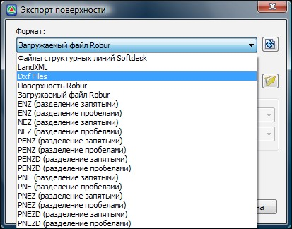

# Экспорт

Поверхность **{{robur}}** может быть экспортирована в большинство вышеперечисленных форматов. К ним относятся следующие:

* Точки в текстовом файле.
* **dxf** - файлы.
* Файл структурных линий **Softdesk Civil/Survey**.
* Файлы проектов **LandXML**.
* Поверхности в формате **{{robur}}**.

Часть экспортируемых файлов хранит полное описание поверхности (точки, треугольники, структурные линии, семантика), в другие же файлы сохраняются лишь отдельные элементы ЦМР, например точки. Более подробно особенности каждого обменного формата были описаны в соответствующих темах посвященных импорту исходных данных для построения поверхности.



1. При экспорте поверхности в dxf формат, ее элементы (точки, структурные линии, треугольники), которым были заданы семантические коды, сохраняются в слоях с соответствующими наименованиями. Например, точка поверхности с кодом (2) будет находиться на слое P2, Структурная линия с кодом (1001 Пункт геодезической сети) соответственно на слое L1001 и т.д.
2. Аналогичным образом, по наименованию слоя автоматически назначаются семантические коды элементов поверхности, при импорте их в ПК {{robur}}.



Для того, чтобы сохранить текущую поверхность в один из вышеперечисленных форматов:

1. Выберите элемент меню **Поверхность - Импорт/Экспорт- Экспорт поверхности**, появится следующие диалоговое окно:

2. В поле **Формат** из выпадающего списка выберите необходимый тип сохраняемого файла:

   

3. Щелкнув по пиктограмме  укажите папку в которую должен быть сохранен выгружаемый файл, путь к ней отобразится в поле **Имя файла**.

4. При необходимости в данном диалоговом окне можно установить дополнительные параметры экспорта :

   **Только точки с кодом** - при установлении данной опции экспортироваться будут только точки, семантический код которых соответствует выбранному. Необходимый код точки также выбирается из выпадающего списка.

5. Нажмите **Ок**.

В результате, данные поверхности будут сохранены в файл соответствующего формата. Находиться данный файл будет в папке, по адресу указанному в поле **Имя файла**.
