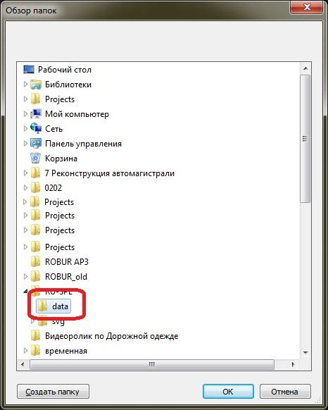
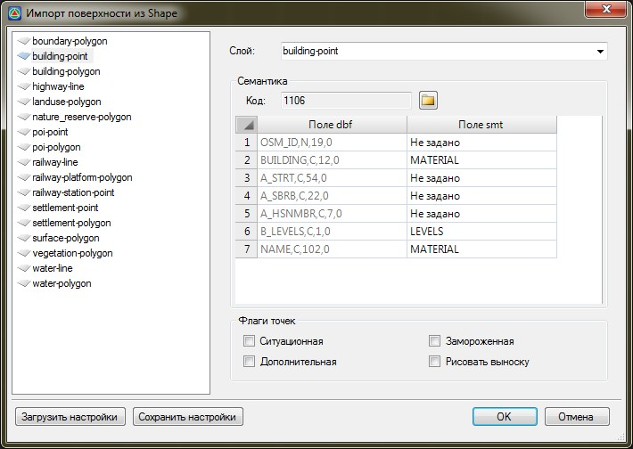
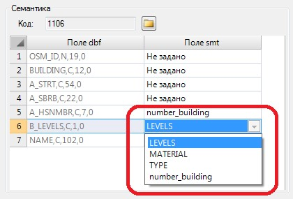
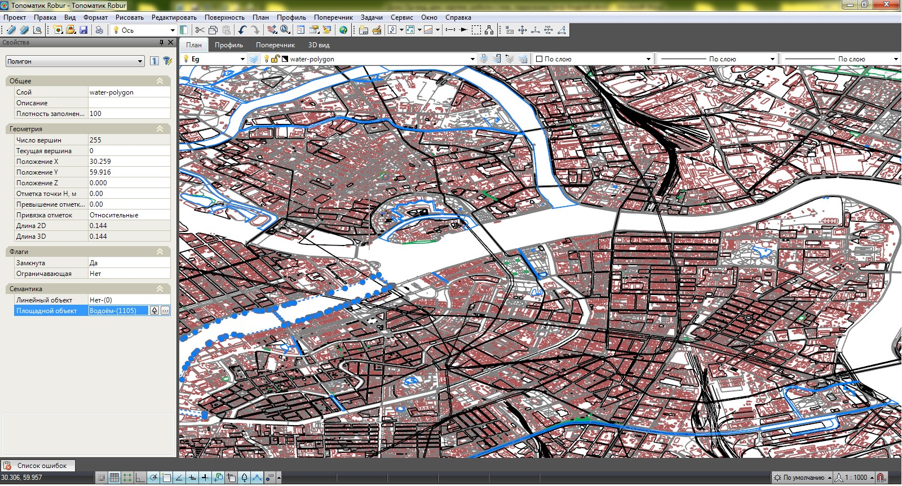
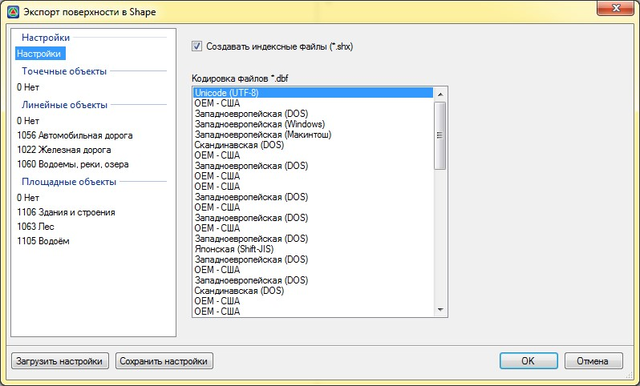
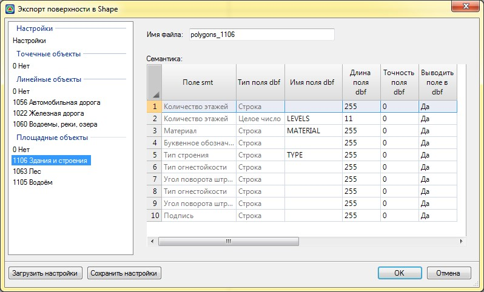

# Shape

Для импортирования поверхности в формате **Shape-файлов**:

1. Выберите меню **Поверхность – Импорт – Импорт Shape**, в открывшемся окне выберите каталог (папку), в котором находятся необходимые файлы (\*.shp, \*.dbf и т.д.) и нажмите **ОК**:

   

2. В открывшемся окне **Импорта** для каждого shape-файла задается наименование слоя и сопоставляется семантическая информация:

   

   В левой части окна в качестве списка отображаются shape-файлы, которые находились в указанной папке импорта. Каждый shape-файл содержит в себе определенный тип данных (точки, полигоны и т.д.).

   Для каждого shape-файла задаются следующие настройки импорта:

   * **Слой** – создается или выбирается имя слоя, в который будут импортированы объекты.
   * В поле **Семантика**, с помощью кнопки  назначается семантический объект, который будет присвоен импортируемым элементам shape-файла. Ниже в таблице сопоставляются параметры объектов shape-файла с семантическими свойствами выбранного объекта путем выбора параметров из выпадающих списков:

     

   * Дополнительные настройки (Флаги).

   Все заданные параметры в данном окне могут быть сохранены в файл (\*.rst) и использованы при последующем импорте shape-файлов, для этого имеются соответствующие кнопки **Сохранить** и **Загрузить настройки**.

3. Нажмите **ОК**. В результате будет импортирована поверхность с назначенными семантическими объектами и заданными параметрами:

   

Для экспортирования поверхности в формате Shape-файлов:

1. Выберите меню **Поверхность – Экспорт – Экспорт Shape**, в открывшемся окне выберите папку для сохранения файлов и нажмите **ОК**.

2. Откроется окно с настройками экспорта данных:

   * Вкладка **Настройки**:

     

     На данной вкладке выбирается кодировка файлов и задается возможность создавать индексные файлы.

   * Вкладка **Точечные, Линейные** и **Площадные объекты**:

     
     
     Данные вкладки содержат списки семантических объектов и их свойства, которые имеются в поверхности.

     Для каждого семантического объекта задается имя файла (\*.shp и ему сопутствующие), а также выполняется детальная настройка формирования файла атрибутов (\*.dbf), т.е. при необходимости задается\меняется **Имя, Длина поля** и **Точность** вывода значений. В столбце **Выводить поле** в dbf может быть выбрано значение **НЕТ** напротив тех полей которые не должны записываться в файл.

     Все заданные параметры в данном окне могут быть сохранены в файл (\*.rst) и использованы при последующем экспорте поверхности в формате shape-файлов, для этого имеются соответствующие кнопки **Сохранить** и **Загрузить** настройки.

3. Нажмите **ОК**.

В результате поверхность будет сохранена в указанную папку в формате **Shap** – файлов.
