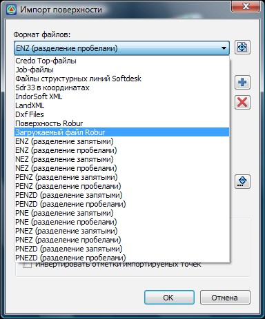
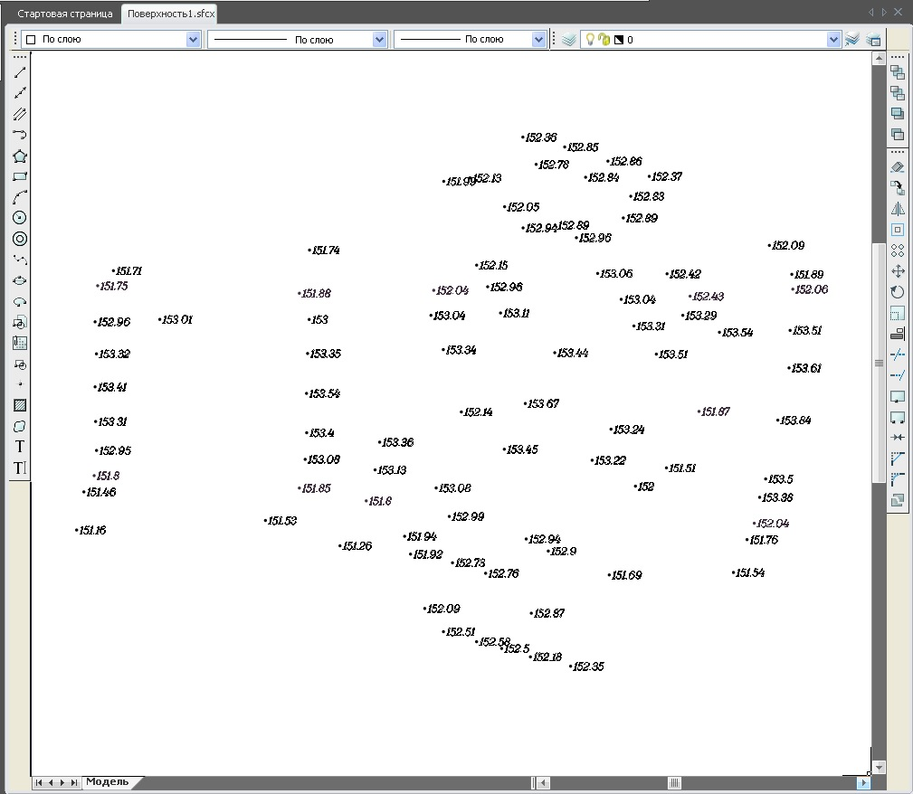
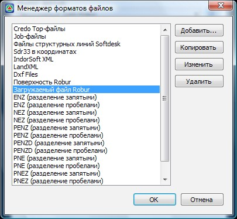
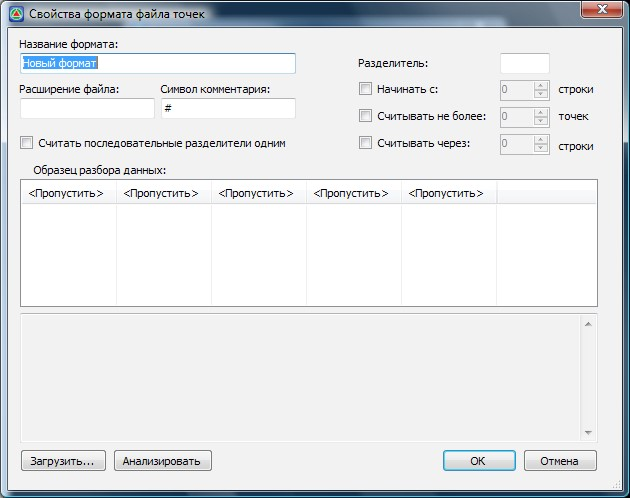
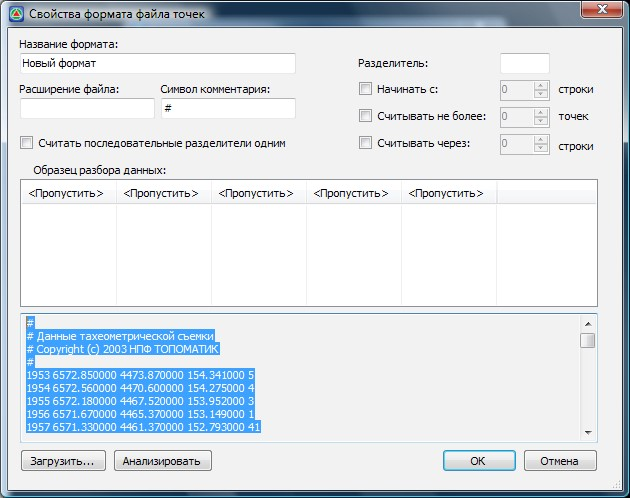
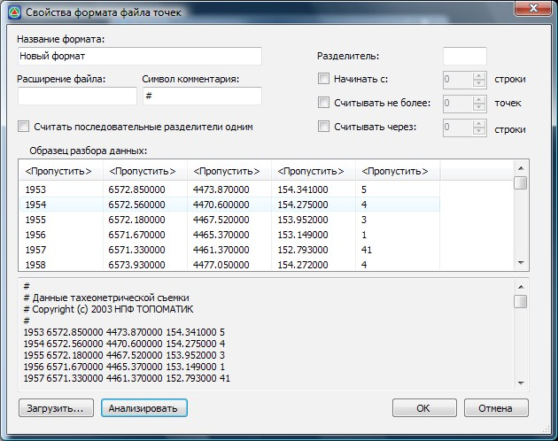
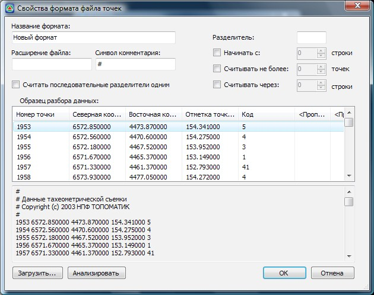
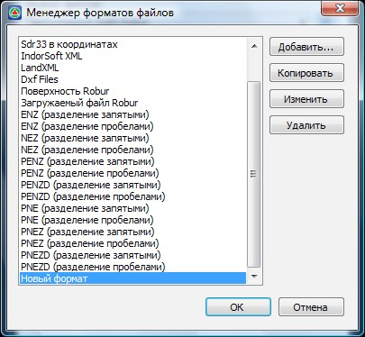
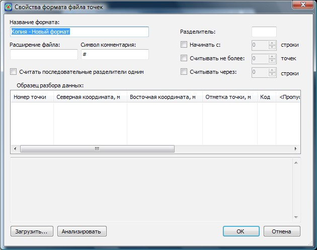

# Текстовый файл

**{{robur}}** позволяет импортировать точки из текстового файла произвольного формата. При этом на структуру файла накладываются следующие требования:

1. Точки должны быть заданы в геодезической системе координат.
2. Описание одной точки должно находиться на одной строке.
3. В качестве разделителей данных в строке могут быть использованы пробелы, знаки табуляции, запятые и т.д.

Для импорта точек из текстового файла:

1. Выберите элемент меню **Поверхность - Импорт/Экспорт-Импорт поверхности**, появится следующие диалоговое окно:

   

2. Из выпадающего списка **Формат файлов** необходимо выбрать соответствующий тип. Выберите вариант **Загружаемый файл формата Robur**:

   

   Если структура импортируемого файла заранее известна и не подлежит предварительному анализу, т.е. известно наименование столбцов, тип разделителей данных и т.п., Вы можете выбрать соответствующий тип формата. Они различаются наименованием столбцов с данными и типом разделителя.

   Например, текстовый файл формата **PNEZD** (разделение пробелами), содержит следующие столбцы данных разделенных пробелом:

    * p (point) - номер точки.
    * n (north) - северная координата точки.
    * e (east) –восточная координата точки.
    * z (elevation)- отметка точки.
    * d (description)- описание точки.

    Если же точное описание импортируемого текстового формата заранее неизвестно, то рекомендуется воспользоваться типом **Загружаемый файл Robur**. Анализирование и настройка импортируемого формата данных будет описана ниже.

3. В поле исходные файлы необходимо задать путь к файлам съемки, которую планируется загрузить.

   Для того, чтобы указать соответствующий файл, нажмите пиктограмму + , затем найдите папку с импортируемым текстовым файлом и выберите его.

   После этого, путь к выбранному файлу отразится в поле **Исходные файлы**.

   

   Исходных файлов для импортирования может быть выбрано несколько.

   

   При необходимости удаления предварительно выбранного исходного файла нажмите пиктограмму 

   В поле **Дополнительные операции** можно задать опции, также влияющие на загрузку съемочных данных:

   **Перестроить исходную поверхность** - если в проект уже были загружены съемочные данные или имеется построенная поверхность, то при догрузки дополнительных точек поверхность будет автоматически перестраиваться.

   **Соединить точки последовательно в линию** - При установлении данной опции загружаемые точки будут автоматически соединяться структурной линией. Последовательность соединяемых точек зависит не от их номера, а от их положения (номера строки) в списке импортируемого файла. Данная функция может быть применима для небольших поверхностей, в которых последовательно снимались характерные контуры (ось, кромки и т.п.).

4. Перед импортом съемочных данных выберите кодификатор из соответствующего выпадающего списка. Кодификатор позволяет задавать соответствие между буквенно-числовыми кодами точек, задаваемыми в процессе съемки и объектами **ЦММ**. Согласно кодификатору, загружаемым точкам может быть автоматически присвоены: тип, свойства, условные обозначения и т.п. По умолчанию в программу заложены два стандартных кодификатора:

   * **Robur-Road** - Автодорожный кодификатор.
   * **Robur-Rail** – Железнодорожный кодификатор.

   Также имеется возможность создавать и использовать в работе собственные кодификаторы. Последовательность действий по созданию и подключению собственного кодификатора будет описана ниже.

5. Выбрав тип импортируемого файла съемки и указав его в поле **Исходные файлы**, нажмите **Ок**.

В результате произойдет загрузка данных, и съемочные точки отобразятся в рабочем окне:



Если при загрузке программа выдала сообщение об ошибке или данные загрузились не корректно, необходимо детально проверить установленные настройки импорта соответствующего формата данных. Более подробно процесс редактирования свойств, а также создание своих индивидуальных форматов описан ниже.



Для того, чтобы добавить или удалить формат импортируемых данных, а также отредактировать настройки импорта существующих, щелкните левой кнопкой мыши на пиктограмме  поля формат файлов, откроется следующее диалоговое окно:

Для того, чтобы создать дополнительный формат файла импорта:

1. Щелкните по кнопке **Добавить**, появится диалоговое окно **Свойства формата файла точек**:

   

2. В данном диалоговом окне задаются основные настройки чтения данных из текстового файла соответствующие выбранному формату, а также производится предварительная проверка их корректной загрузки.

   В поле **Название формата** задается наименование создаваемого формата данных.

   В поле **Расширение файла** задается соответствующее расширение файла, из которого планируется подгружать данные. Т.е. данная опция является своеобразным фильтром для последующего выбора импортируемых файлов, доступными будут только те текстовые файлы, расширение которых совпадает с заданным.

   Как правило, большинство, текстовых файлов съемки содержит информацию описательного характера, например: дата съемки, исполнитель и т.п. Если эти строки не должны учитываться при импорте точек, то в текстовом файле перед ними ставится соответствующий префикс (по умолчанию #).

   Соответственно, в поле **Символ комментария** необходимо задать условный знак соответствующий строкам описания в текстовом файле.

   Все данные в строке должны быть разделены с помощью специальных разделителей, например: X\_Y\_Z и т.д. Если между значениями находится несколько разделителей (X\_ \_ \_Y\_ \_ \_Z), то для корректного импорта данных рекомендуется установить опцию **Считать последовательные разделители одним**.

   В поле **Разделитель** необходимо указать, какой именно символ является разделителем данных в строке. Если ни какого символа не указано, то по умолчанию в качестве разделителя принимается пробел или табуляция.

   В поле **Начинать** с можно указать строку с которой необходимо начинать загрузку данных. Это поле может быть полезно для импорта съемки из файлов, первые строки которых содержат заголовки и не должны быть использованы при импорте.

   В поле **Считывать не более** может задаться ограничение на количество точек загружаемых из файла.

   Если съемочных точек большое количество (например, съемка получена по результатам лазерного сканирования) и для быстродействия системы часть из них необходимо отсеить, можно воспользоваться опцией **Считывать через**. В соответствующем поле задается число строк в файле, которые будут игнорироваться после загрузки. К примеру, если установлено значение 2, то после импорта первой точки две следующие строки будут пропущены, и так до конца списка.

   Если необходимо просмотреть структуру импортируемого файла без его непосредственного открытия, нажмите **Загрузить**, после чего укажите соответствующий файл съемки. Содержимое текстового файла будет отображено в текущем окне:

   

   После того как соответствующий тип разделителя и прочие настройки заданы, нажмите **Анализировать**, программа автоматически отсортирует данные по колонкам и отобразит их в поле **Образец разбора данных**.

   

   Если данные по столбцам отсортированы корректно, укажите назначение каждого столбца импортируемого файла. Для этого щелкните по заголовку столбца и из выпадающего списка укажите тип поля.

   Пример назначенных столбцов с данными представлен ниже:

   

3. Нажмите **Ок**.

В результате вновь созданный формат отобразится в списке окна **Менеджер форматов файлов**, в последствии, его можно многократно использовать его для импорта данных из текстовых файлов, аналогично стандартным форматам заложенных в программу.

Если необходимо скопировать какой-то из имеющихся форматов файлов, в диалоговом окне **Менеджер форматов файлов**, нажмите кнопку **Копировать**. Откроется диалоговое окно **Свойства формата файла точек**:

Введите название скопированного формата и при необходимости отредактируйте его остальные настройки. Параметры данного диалогового окна были описаны выше (Создание нового формата).

Если необходимо изменить какой-то из имеющихся форматов файлов, в диалоговом окне **Менеджер форматов файлов**, нажмите кнопку **Изменить**. Откроется диалоговое окно **Свойства формата файла точек**. При необходимости отредактируйте остальные настройки. Параметры данного диалогового окна были описаны выше (Создание нового формата).

Для того, чтобы удалить какой-то из имеющихся форматов импорта , в диалоговом окне **Менеджер форматов файлов**, нажмите кнопку **Удалить**.



 Не все из имеющихся форматов можно удалять, копировать и редактировать.


