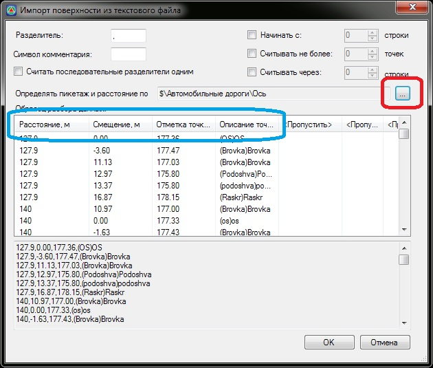

# ТХТ с привязкой точек к подобъекту

Данная функция позволяет импортировать txt файл с точками поверхности, определяя положение точек относительно оси подобъекта.

Для этого:

1. Выберите меню **Проект – Импортировать – Поверхность.**
2. В открывшемся окне **Импорта поверхности**, с помощью кнопки  выберите подобъект относительно которого будут вычисляться **Расстояния (ПК+) и Смещения**, а столбцам назначьте необходимый тип данных:
   
   

3. Задав необходимые параметры нажмите **Ок**.

В результате произойдет загрузка данных и они отобразятся в рабочем окне.
