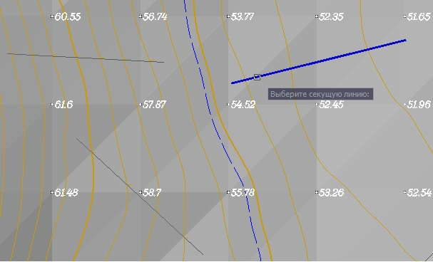

# Удалить подпись бергштриха

Бергштрихи располагаются строго по линии, по которой они задавались. Данная функция позволяет удалить бергштрихи.

Для этого:

1. Выберите элемент меню **Поверхность – Горизонтали – Удалить подпись бергштриха**:

   

2. Выберите линию, бергштрихи по которой необходимо удалить. При необходимости можно выбрать сразу несколько линий секущей рамкой.
3. Если необходимо, повторите шаг 2.
4. Нажмите клавишу **ENTER** для завершения команды.
