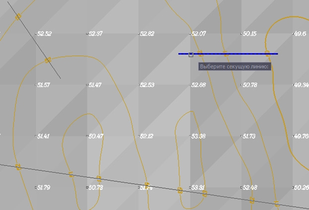

# Удалить подпись горизонтали

Подписи горизонталей располагаются строго по линии, по которой они задавались. Данная функция позволяет удалить подписи горизонталей.

Для этого:

1. Выберите элемент меню **Поверхность – Горизонтали – Удалить подпись горизонтали**:
   
   

2. Левой кнопкой мыши выберите линию, подписи горизонталей по которой необходимо удалить. При необходимости можно выбрать сразу несколько линий секущей рамкой.
3. Если необходимо, повторите шаг 2.
4. Нажмите клавишу **ENTER** для завершения команды.
