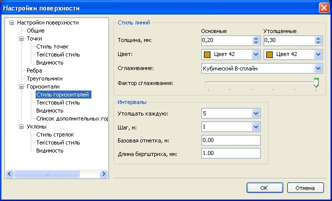
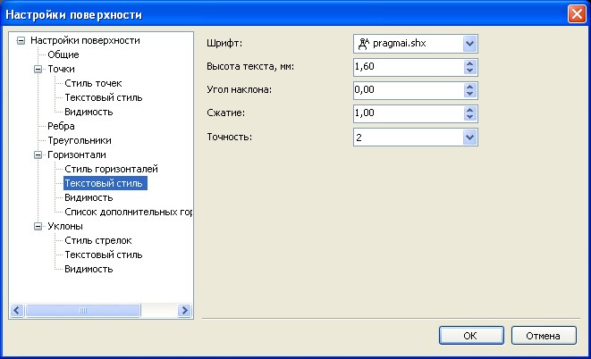
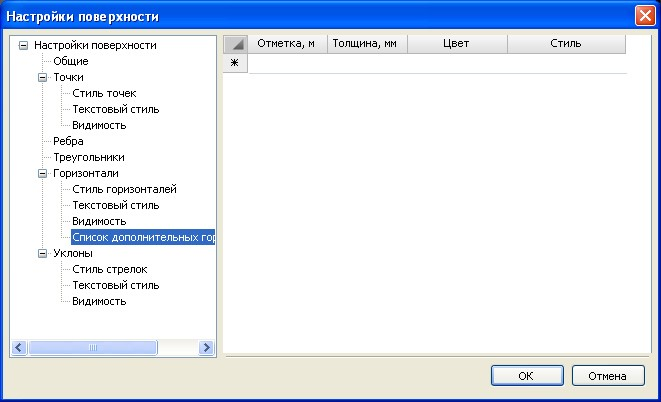
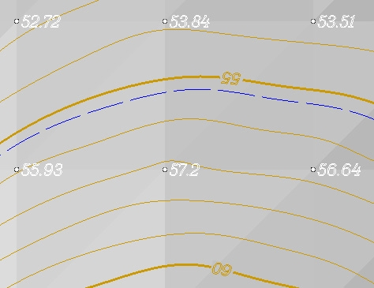

# Настройки

Данная функция используется для настройки общих параметров отображения горизонталей на плане и подписей к ним.

Чтобы настроить отображение горизонталей на плане:

Выберите элемент меню **Поверхность – Настройка поверхности**, в появившемся диалоговом окне раскройте дерево объектов до элемента поверхности - **Горизонтали**:

## Стиль горизонталей

В данном окне задаются настройки текущей модели ЦММ. Для задания настроек по умолчанию для вновь создаваемых моделей, а также общих настроек проекта, воспользуйтесь элементом меню **Сервис - Настройки**.

**Стиль линий** – в этой группе элементов устанавливается толщина основных и утолщённых горизонталей, из раскрывающейся палитры цветов можно выбрать цвет горизонталей, тип сглаживания (горизонтали могут отрисовываться полилиниями или в виде В-сплайнов), а также фактор сглаживания горизонталей.

**Интервалы** – в данном поле задается шаг основных и утолщенных горизонталей, длина бергштриха и базовая отметка, от которой будут считаться горизонтали.

## Текстовый стиль

**Стиль текста** – в этой области задается шрифт и размер подписи основных и утолщенных горизонталей, а также точность отображения отметок.

## Видимость

**Отображать горизонтали** – включается/выключается видимость различных видов горизонталей и подписей к ним.

**Не строить горизонтали на участках с уклоном более** – данная функция позволяет автоматически скрывать горизонтали на участках с уклоном более заданного. Данная функция скрывает горизонтали на бортовых камнях, подпорных стенках и т.д.

## Дополнительные горизонтали

Функция **Список дополнительных горизонталей** используется для задания и настройки отображения дополнительных горизонталей.

Описание одной горизонтали занимает одну строку.

В столбце **Отметка** задается отметка новой горизонтали.

В столбце **Толщина** задается толщина дополнительной горизонтали .

В столбце **Цвет** из раскрывающейся палитры цветов можно выбрать цвет дополнительных горизонталей.

В столбце **Стиль** задается тип дополнительной горизонтали (**Дополнительная, Вспомогательная, Нависающий уклон**). В зависимости от выбранного типа будет меняться отображение горизонтали на плане:

