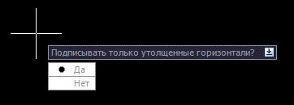

# Подписать горизонтали

Данная команда позволяет подписать горизонтали по линии. Для этого:

1. Выберите элемент меню **Поверхность – Горизонтали – Подписать горизонтали**:
   
   

2. Выберите один из вариантов подписи горизонталей. Выберите **Да** для подписи только утолщенных горизонталей, **Нет** – для подписи всех горизонталей.
3. Левой кнопкой мыши задайте линию, в местах пересечения которой с горизонталями будут рисоваться подписи.
4. Если необходимо, повторите шаги 2 и 3.
5. Нажмите клавишу **ENTER** для завершения команды.
