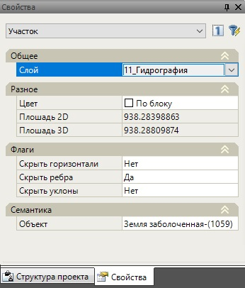

# Свойства

Параметры участка, аналогично другим элементам проекта можно модифицировать непосредственно из диалогового окна **Свойства**:

Часть полей данного окна доступны для редактирования, а часть носит исключительно информационный характер.

* **Не отображать горизонтали** - Если установлен параметр ДА, то по треугольникам входящим в выбранный участок не будут отрисовываться горизонтали.

* **Не отображать ребра** - Если установлен параметр ДА, то y треугольников входящих в указанный участок не будут отображаться ребра.

* **Не отображать уклоны** - Если установлен параметр ДА, то y треугольников входящих в указанный участок не будут отображаться уклоноуказатели.

* **Площадь,м2** – в этом информационном поле указывается суммарная площадь треугольников входящих в указанные участки.

* **Семантический код** - в данном поле, участку можно присвоить необходимый семантический код. В зависимости от семантического кода и других дополнительных свойств, участок может отрисовываться соответствующим цветом или площадным условным знаком.

* **Название семантической группы** - данное поле является информационным, в нем дается описание выбранного семантического кода.
