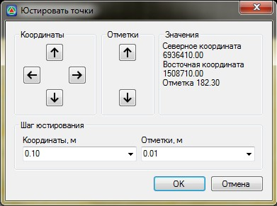

# Юстировать

Функция позволяет изменять горизонтальное и вертикальное положение точки с заданным шагом. К примеру, она может быть использована при проектировании водоотводов на площадных объектах.

Для этого:

1. Выберите меню **Поверхность – Точки – Юстировать**, курсор примет форму прицела.
2. Левой кнопкой мыши укажите точку, параметры которой необходимо изменить, откроется диалоговое окно:

   
