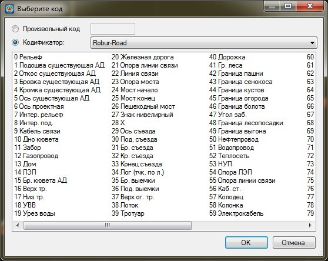

# Подсветить

Данная функция позволяет выделить на экране отдельным цветом группу точек, имеющих определенный семантический код.

Для того, чтобы выделить точки по семантическому коду:

1. Выберите элемент меню **Поверхность – Точки – Подсветить**. Откроется диалоговое окно выбора семантического кода:

   

2. Выберите семантический код из списка и нажмите **OK**. При необходимости подсветки кода, который отсутствует в кодификаторе, выберите опцию **Произвольный код**, указав номер кода в соответствующем поле ввода. Также можно подсветить несколько семантических кодов одновременно, используя мышь и комбинации клавиш **Ctrl** и **Shift**.

Все точки, у которых семантический код совпадает с указанным, будут выбраны и подсвечены определенным цветом, в соответствии с настройками программы.



 Данная функция не осуществляет выбор точек с заданным семантическим кодом, а лишь подсвечивает их отдельным цветом. Если же требуется изменить у подсвеченных точек какое-либо свойство, их необходимо предварительно выбрать. Воспользуйтесь для этого элементом меню **Поверхность – Точки –Выделить подсвеченные**.


