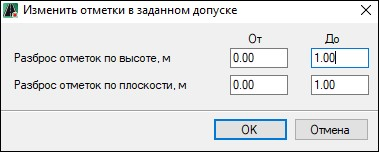

# Изменить отметки в заданном доступе

Данная функция позволяет случайным образом изменять высоты отметок и координаты точек поверхности в заданном допуске.

Для этого:

1. Сделайте текущей модель **ЦММ**, в которой необходимо произвести изменения.
2. Выберите меню **Поверхность – Утилиты – Изменить отметки в заданном доступе**, откроется диалоговое окно:

   

   В полях **От** и **До** задайте диапазон отклонений которые будут добавлены к высотному и плановому положению каждой точке поверхности.
   
В результате, программа изменит значение высот точек и их положение на плане.
