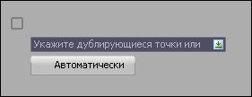
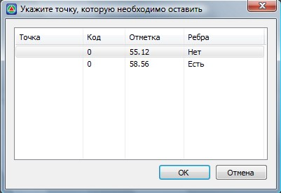

# Корректировать

Для того, чтобы откорректировать дублирующиеся точки:

1. Выберите элемент меню **Поверхность – Точки – Корректировать**.
2. Укажите группу дублирующихся точек:
   
    

3. Откроется диалоговое окно:
   
    

    Так как точки могут иметь разные коды, разные отметки и номера, выберете одну из точек, которую необходимо оставить и нажмите **ОК**.
4. Если необходимо, повторите шаги 2-3.
5. Нажмите клавишу **ENTER** для завершения команды.



После выполнения п.1, нажав клавишу Вниз на клавиатуре, можно выбрать автоматический режим корректирования дублирующих точек. При этом программа просмотрит все группы дублирующих точек и в каждой группе оставит первую точку по номеру.


