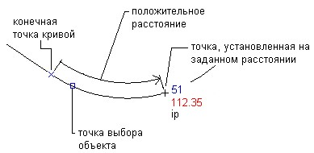

# Вдоль линии/кривой

Данная команда предназначена для создания точек вдоль линии, полилинии или дуги на заданном расстоянии от конечной точки.

Укажите левой кнопкой мыши конечную точку, от которой требуется измерять расстояние и задайте его значение.

Схема задания расстояния для указания местоположения точки, расположенной вдоль объекта, представлена ниже:

 Чтобы создать точки вдоль линии или кривой:

1. Выберите пункт меню **Поверхность – Точки - Разметить – Вдоль линии/кривой**.
2. Выберите левой кнопкой мыши линию, полилинию или дугу. Конечная точка, ближе всех расположенная к выбранной точке, выделяется фоновой подсветкой.
3. Откроется окно **Свойства точки поверхности**, в котором можно ввести имя точки, ее описание и всю необходимую семантическую информацию. Эти параметры будут применены для всех введенных точек.
4. Если необходимо, повторите шаги 2-3.
5. Нажмите клавишу **ENTER** для завершения команды.
