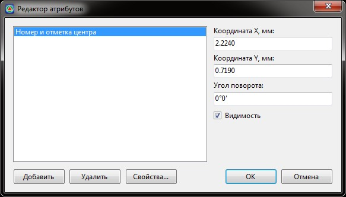
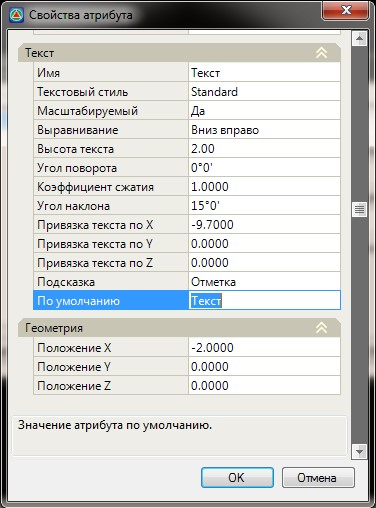
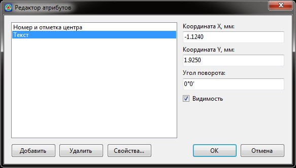

# Редактировать атрибуты

Атрибут представляет собой дополнительную текстовую, цифровую или иную информацию, связанную с точечным объектом.

Функция предназначена для управления видимостью, расположением и созданием новых атрибутов. Для этого:

1. Выберите меню **Поверхность – Точки – Редактировать атрибуты**, курсор примет форму прицела.
2. Укажите точечный объект, атрибуты которого необходимо отредактировать, откроется диалоговое окно:

   

    В левой части окна перечислены атрибуты выбранного объекта.

## Добавление нового атрибута

1. Для создания нового атрибута нажмите кнопку Добавить, откроется диалоговое окно:

   
   
   Основные параметры атрибутов описаны в п. **Задание атрибутов**.

Более подробно рассмотрим поле ввода - **По умолчанию**, так как содержимое данного поля определяет какая информация в результате будет отображена.

Данное текстовое поле может содержать:

* Текст
* Стандартные Тэги (X, Y, Z, CODE, NUMBER).
* Пользовательские Тэги.



Более подробная информация по Тегам имеется в документации [Приложение. Библиотека семантических объектов, гл. Список идентификаторов (Тегов) стандартных свойств элементов проекта](../../../../annex/library_semantics/identifier_property.md).



1. Задайте необходимые параметры атрибута и нажмите **Ок**. Новый атрибут появится в списке:

   

   Параметры каждого атрибута (координаты, угол, видимость) можно настроить, используя поля ввода в правой части окна **Редактора атрибутов**.

2. Для выхода из окна **Редактор атрибутов** нажмите **ОК**.
