# Ввод



## {#ruchnoj-vvod}

Для ввода дополнительной точки на активную поверхность выберите элемент меню **Поверхность – Точки – Ввести**. На экране появится курсор в виде перекрестия с полями динамического ввода:

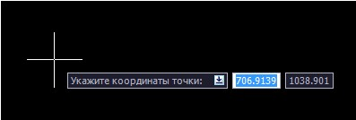

С помощью курсора укажите положение новой точки на экране или задайте ее положение на плане в координатах, используя динамический ввод.

После указания положения точки на плане откроется окно **Свойства точки поверхности**, в котором автоматически занесены координаты новой точки и установлен флаг **Дополнительная**:

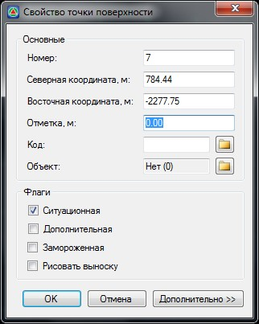

В диалоговом окне в поле **Основные**, Вы можете изменить описание точки, северную, восточную координату отметку, и семантический код.



По умолчанию в полях Северная и Восточная координата отображаются X-, Y-координаты точки, на которую указывал курсор, а отметка Z принимается по активной поверхности.



Для того, чтобы назначить семантический код точке поверхности введите его в соответствующем поле или выберите необходимый код из списка нажав пиктограмму .

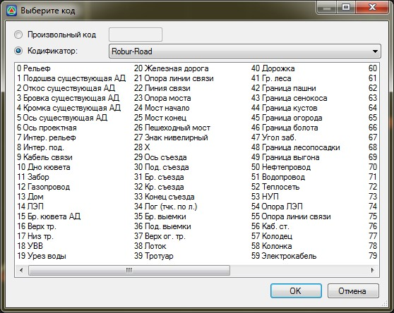

Если заданный семантический код соответствует коду точечного объекта, то программа автоматически вставит на план условный знак данного точечного объекта.

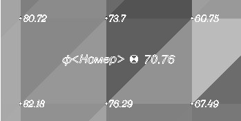

Каждая точка может иметь один или несколько флагов **Ситуационная, Дополнительная, Замороженная, Рисовать выноску**. Эти флаги используются для реализации различных возможностей работы с поверхностью.

Флаг **Ситуационная** устанавливается на точки, которые описывают ситуацию и не участвуют в построении цифровой модели рельефа.

*Ситуационная точка:*

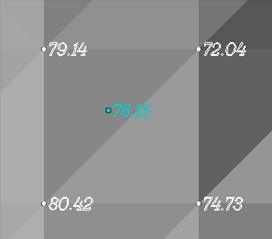

*Рельефная точка:*

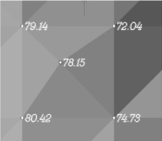

Флаг **Дополнительная** устанавливается автоматически для тех точек, которые вводятся в поверхность вручную.

Флаг **Замороженная** устанавливается на точки, подписи которых (а также условные знаки которых) должны иметь постоянный угол ориентации относительно системы координат и других объектов.

При повороте экрана или при создании планшета все точки автоматически будут ориентироваться по экрану или по границе листа. Точки, в свойствах которых установлен признак **Замороженная**, всегда ориентируются по углу заданному в ее свойствах.

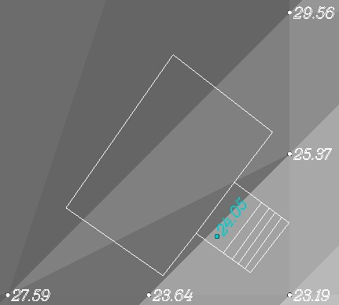

Флаг **Рисовать выноску** устанавливается на точки в том случае, если в дальнейшем при оформлении планшета (при большей плотности точек поверхности) данные по этим точкам необходимо рисовать на выносках. Например, верх и низ бортового камня при съемке городской улицы.

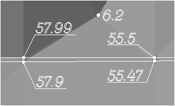

После задания необходимых свойств точки нажмите **ОК**.



Добавление новых рельефных точек в пределах построенной поверхности приводит к автоматическому обновлению поверхности.







## {#vvesti-po-vysote}

Данная функция позволяет быстро создать группу точек с заданной отметкой. К примеру, она может быть использована при оцифровке горизонталей с растровой подложки.

Для этого:

1. Выберите меню **Поверхность – Точки – Ввести по высоте**, курсор примет форму прицела.
2. В динамической строке укажите значение высотной отметки и нажмите **Enter**.
3. В графическом поле программы введите группу точек.





## {#vvesti-otnositelno-drugoj}

Данная функция позволяет создать точку относительно другой точки на заданном расстоянии и с необходимым уклоном или превышением.

Для этого:

1. Выберите меню **Поверхность – Точки – Ввести относительно другой**, курсор примет форму прицела.
2. Укажите левой кнопкой мыши базовую точку, относительно которой будет добавлена новая.
3. В динамической строке задайте расстояние от исходной точки и угол относительно горизонтальной оси.Для подтверждения ввода нажмите **Enter**. Также можно визуально указать местоположение новой точки.
4. Укажите **Превышение** или **Уклон** относительно базовой точки.





## {#vvesti-po-pksmesheniyu}

Данная функция позволяет ввести точку по пикету и смещению относительно выбранной модели подобъекта, для этого:

1. Выберите меню **Поверхность - Точки - Ввести по ПК+смещению**, курсор примет форму прицела, укажите модель подобъекта.
2. В строке динамического ввода укажите пикет и нажмите **Enter**:

   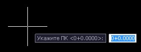

3. В строке динамического ввода укажите величину смещения и нажмите **Enter**:

   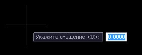

   Откроется диалоговое окно свойств созданной точки:

   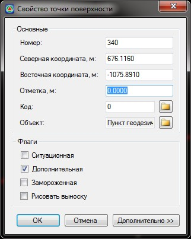
   
4. При необходимости уточните в данном окне параметры создаваемой точки и нажмите **ОК**.





## {#dopolnitelnye-vozmozhnosti-vvoda}

При задании точки с использованием полей динамического ввода возможны несколько вариантов назначения ее положения на плане.

Для выбора одного из вариантов динамического ввода в процессе выполнения команды нажмите кнопку вниз на клавиатуре:

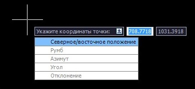

Режим ввода точки также можно поменять используя контекстное меню:

Или элементы главного меню:

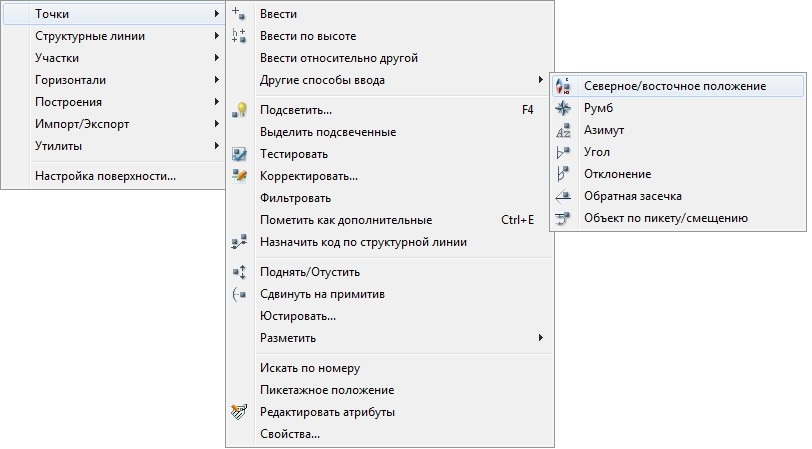

* **Северное/восточное положение** – при выборе этого пункта программа попросит ввести в динамическом поле сначала северную, а затем восточную координату. После чего откроется окно **Свойства точки поверхности**. В нем необходимо задать отметку и необходимую семантическую информацию.

* **Румб** – прежде чем указать румб или расстояние, необходимо задать точку, от которой они измеряются. Если вводится одна или более точек, то используется последняя введенная точка. Если точки не вводились, будет выдан запрос об указании точки.

В выполняющейся команде происходит обновление линии начала отсчета каждый раз, когда вводится точка.

Последовательность действий при создании точки с использованием команды **Румб**:

1. Укажите левой кнопкой мыши точку, из которой будут измеряться румб и расстояние.
2. Укажите левой кнопкой мыши квадрант в графическом поле программы или введите значение от 1 до 4.

   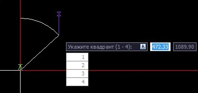

3. Графически задайте левой кнопкой мыши румб в соответствующем квадранте, либо введите его значение в поле динамического ввода.

   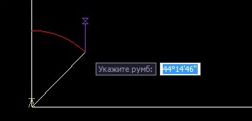

4. Задайте расстояние, указав его левой кнопкой мыши на плане, либо введите его значение в поле динамического ввода.

   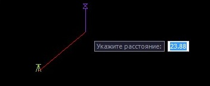

5. Задайте значение уклона/превышения для расчета **отметки Z** точки относительно исходной точки.

   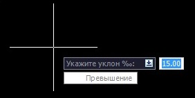

   Нажав клавишу **Вниз** на клавиатуре, можно выбрать режим расчета **отметки Z** вводимой точки, либо по уклону, либо по превышению над исходной точкой.

6. После задания всех необходимых значений откроется окно **Свойств точки
поверхности**, в котором можно при необходимости задать семантическую информацию и откорректировать свойства точки.

* **Азимут** – прежде чем указать азимут и расстояние в этой команде, необходимо задать точку, из которой они измеряются. Если вводятся одна или более точек, то используется последняя введенная точка. Если точки не вводились, будет выдан запрос об указании точки.

При вводе каждой последующей точки происходит обновление опорной точки.

Последовательность действий при создании точки с использованием команды **Азимут**:

1. Если в текущей команде еще не введены точки, необходимо указать временную точку, из которой будут измеряться азимут и расстояние.
2. Графически задайте угол на плане с помощью левой кнопки мыши или введите его значение в поле динамического ввода.

   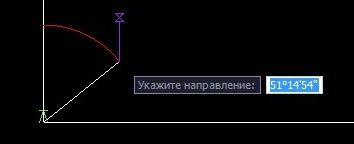

3. Задайте левой кнопкой мыши расстояние на плане, либо введите его значение в поле динамического ввода.

   

4. Задайте значение уклона/превышения для расчета **отметки Z** точки относительно исходной точки.

   

   Нажав клавишу **Вниз** на клавиатуре, можно выбрать режим расчета **отметки Z** вводимой точки, либо по уклону, либо по превышению над исходной точкой.

После задания всех необходимых значений откроется окно **Свойств точки поверхности**, в котором можно задать необходимую семантическую информацию и откорректировать свойства точки.

* **Угол** – прежде чем указывать угол и расстояние, необходимо задать начальную точку и линию начала отсчета, относительно которых они будут измеряться.

Если вводится множество точек, то последняя введенная точка будет являться начальной. После чего, будет выдан запрос о второй точке для определения линии начала отсчета. Если эти точки не введены, то выдается запрос об введении начальной точки и определении линии отсчета.

В данной команде происходит обновление линии начала отсчета каждый раз, когда вводится новая точка.

Последовательность действий при создании точки с использованием команды **Угол**:

1. Укажите левой кнопкой мыши исходную точку для определения линии отсчета.

   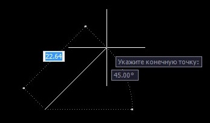

2. Левой кнопкой мыши графически задайте угол относительно намеченной линии, либо введите его значение в строке динамического ввода.

   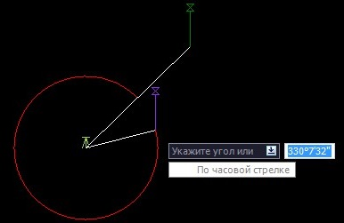

    Нажав клавишу **Вниз** на клавиатуре, можно выбрать режим задания угла, либо по часовой стрелке, либо против часовой стрелки.

3. Задайте расстояние, указав его левой кнопкой мыши на плане, либо введите соответствующие значение в строке динамического ввода.

   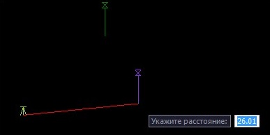

4. Задайте значение уклона/превышения для расчета **отметки Z** точки относительно исходной точки.

   

   Нажав клавишу **Вниз** на клавиатуре, можно выбрать режим расчета **отметки Z** вводимой точки, либо по уклону, либо по превышению над исходной точкой.

После задания всех необходимых значений откроется окно **Свойств точки поверхности**, в котором можно задать необходимую семантическую информацию и откорректировать свойства точки.

* **Отклонение** – прежде чем указать угол отклонения и расстояние, необходимо задать временную линию начала отсчета. Угол отклонения измеряется от линии начала отсчета, продолженной за начальную точку, а расстояние измеряется от начальной точки линии.

Если вводится множество точек, то точка, введенная последней, будут начальной для следующего ввода. Если точки не вводились, то будет выдан запрос об указании начальной и конечной точки, определяющих линию.

В данной команде происходит обновление линии начала отсчета каждый раз, когда вводится новая точка.

Последовательность действий при создании точки с использованием команды **Отклонение**:

1. Если в текущей команде еще не введены точки, необходимо левой кнопкой мыши указать исходную точку и точку для определения линии отсчета.

   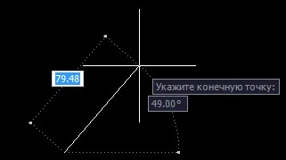

   Программа продлит линию отсчета за начальную точку. Относительно этой линии будет вычисляться угол привязки точки.

2. Левой кнопкой мыши графически задайте угол относительно намеченной линии,либо введите его значение в строке динамического ввода.

   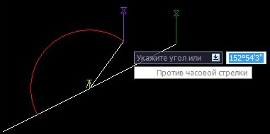

   Нажав клавишу **Вниз** на клавиатуре, можно выбрать режим задания угла, по часовой стрелке, либо против часовой стрелки.

3. Задайте расстояние, указав его с помощью левой кнопки мыши на плане, либо введите требуемое значение в строке динамического ввода.

   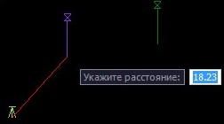

4. Задайте значение уклона/превышения для расчета **отметки Z** точки относительно исходной точки.

   

   Нажав клавишу **Вниз** на клавиатуре, можно выбрать режим расчета **отметки Z** вводимой точки, либо по уклону, либо по превышению над исходной точкой.

После задания всех необходимых значений откроется окно **Свойств точки поверхности**, в котором можно задать необходимую семантическую информацию и откорректировать свойства точки.





## {#obratnaya-zasechka}

Данная функция предназначена для создания новой точки, положение которой рассчитывается по углам, измеренным между тремя известными точками.

Введите вначале точку обратного визирования (опорную точку), затем - две точки, на которые направлена визирная линия и углы для каждой из этих точек.

Отложение измеренных углов от известных точек для определения положения создаваемой точки схематично показано ниже:

Чтобы создать точку по обратной засечке:

1. Выберите элемент меню **Поверхность – Точки - Другие способы ввода – Обратная засечка**.
2. Укажите первую точку (обратного визирования или опорную), вторую точку, третью точку.
3. Введите угол между первой и второй точкой и угол между первой и третьей точкой.
4. Откроется окно **Свойства точки поверхности**, в котором можно ввести имя точки, описание точки, отметку и всю необходимую семантическую информацию. Эти параметры будут применены для всех введенных точек.
5. Если необходимо, повторите шаги 2-4.
6. Нажмите клавишу **ENTER** для завершения команды.


