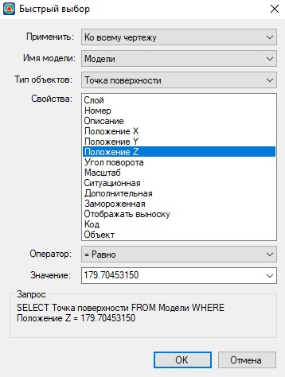

# Фильтрация

Для удобства выбора точек по их свойствам (например, отметке или описанию), по типам или классификации объектов, можно использовать функцию быстрого выбора.

Например, можно выбрать в чертеже все точки с одинаковой отметкой или все ситуационные точки.

Выделение объектов ЦММ с помощью функции быстрого выбора:

1. Запустите команду Быстрый выбор нажав пиктограмму  в боковом окне свойств.

   Ниже, в качестве примера, показан способ применения функции **Быстрый выбор** для выделения на поверхности всех точек имеющих отметку **12.58**.

2. В диалоговом окне **Быстрый выбор** в списке **Применить** выберите пункт **Ко всему чертежу**.

3. Из выпадающего списка **Имя модели** выберите **Поверхность**.

4. Из выпадающего списка **Тип объектов** выберите **Точка поверхности**.

5. Из выпадающего списка **Свойства** выберите **Отметка H,м**.

6. Из выпадающего списка **Оператор** выберите **Равно**.

7. Из выпадающего списка **Значение** напишите **12.58**.

8. Нажмите кнопку **ОК**.

   

   При этом на текущей поверхности будут выбраны все точки имеющие отметку **12.58**



Функция **Быстрый выбор** может быть использована как для поверхности, так и для элементов ситуации.


