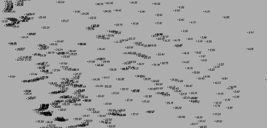
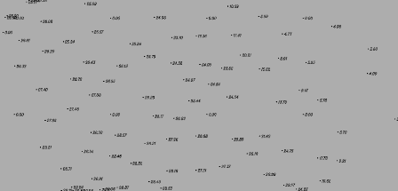

# Фильтровать

Данная функция позволяет автоматически скрыть часть точек поверхности. К примеру, это удобно при работе с поверхностями с большим массивом точек.

Для этого:

1. Выберите меню **Поверхность – Точки – Фильтровать**.

2. В строке динамического ввода задайте **Радиус фильтрации** - это область вокруг точки, попадая в которую, иные точки будут скрыты, далее нажмите правой кнопкой мыши или **ENTER**.

3. Секущей рамкой выберите область точек поверхности, на которой необходимо провести фильтрацию.

В результате соответствующим точкам поверхности будет задан флаг **Дополнительная**, и они будут перемещены в отключенный по умолчанию слой **Дополнительные отметки**.

Ниже представлен пример поверхности до и после фильтрации точек.

Поверхность до фильтрации точек:

Поверхность после фильтрации точек:

