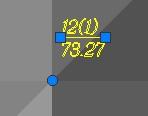
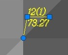

# Перемещение подписей на плане

Положение подписи относительно точки может быть задано индивидуально для каждой из них в боковом окне **Свойства**. Если настройки положения подписи не заданы для точки, то по умолчанию значения отступа и наклона подписи определяются из общих настроек отображения точек. Для удобства пользователя в случае, когда настройка этих параметров не позволяет добиться необходимого отображения подписей, можно вручную перемещать подписи точек и менять их угол наклона.

Для того, чтобы откорректировать положение подписи вручную:

1. Выделите точку левой кнопкой мыши. При этом рядом с подписью точки появятся квадратные маячки синего цвета:
   
   

2. Используя левый маячок, задайте положение подписи, используя правый – поворот. При этом, если в свойствах точки был установлен флаг **Отображать выноску**, на плане появится выноска соединяющая точку и подпись:
   
   
