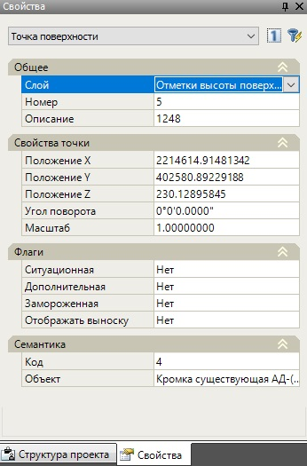

# Свойства

Для доступа к параметрам точки также служит боковая панель свойств. Выберите одну или более точек и их параметры появятся на панели свойств. Большинство свойств точки будут доступны для редактирования.

В свойствах точек указаны все сведения, связанные с ней, в том числе, такие как описание точки, северное и восточное положения в координатах, отметка, положение подписи отметки, семантическая информация и флаги. Описание всех данных параметров было приведено выше, в подразделе [Ввод точек](enter_dots.md#ruchnoj-vvod).
