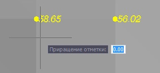

# Поднять/опустить точки

Данная функция предназначена для изменения отметки Z у группы точек.

Чтобы изменить отметку группы точек:

1. Выберите элемент меню **Поверхность – Точки - Поднять/опустить точки**.
2. Выделите точку или группу точек. После завершения выбора нажмите правую клавиш мыши.
3. В поле динамического ввода задайте приращение отметки, в метрах. При этом положительное приращение будет увеличивать отметку, отрицательное – уменьшать:

   

   В результате, отметка точек изменится на заданную величину приращения.

4. Если необходимо, повторите шаги 2-3.
5. Нажмите клавишу **ENTER** для завершения команды.



 При выполнении данной команды произойдет автоматическое перестроение поверхности.


