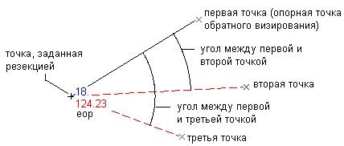

# Обратная засечка

Данная функция предназначена для создания новой точки, положение которой рассчитывается по углам, измеренным между тремя известными точками.

Введите вначале точку обратного визирования (опорную точку), затем - две точки, на которые направлена визирная линия и углы для каждой из этих точек.

Отложение измеренных углов от известных точек для определения положения создаваемой точки схематично показано ниже:

Чтобы создать точку по обратной засечке:

1. Выберите элемент меню **Поверхность – Точки - Другие способы ввода – Обратная засечка**.
2. Укажите первую точку (обратного визирования или опорную), вторую точку, третью точку.
3. Введите угол между первой и второй точкой и угол между первой и третьей точкой.
4. Откроется окно **Свойства точки поверхности**, в котором можно ввести имя точки, описание точки, отметку и всю необходимую семантическую информацию. Эти параметры будут применены для всех введенных точек.
5. Если необходимо, повторите шаги 2-4.
6. Нажмите клавишу **ENTER** для завершения команды.
