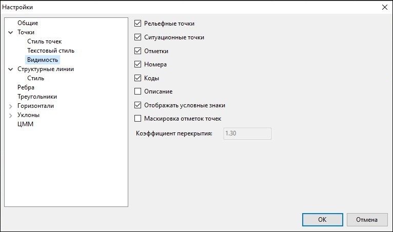

# Настройки

Данная функция используется для настройки общих параметров отображения точек текущей ЦММ и подписей к ним.

Чтобы настроить отображение точек на плане:

Выберите элемент меню **Поверхность – Настройка поверхности**.

Откроется окно **Настройки поверхности**. Раскройте дерево объектов и выберите группу **Точки**:

## Стиль точек

Это группа элементов, которая содержит опции для настройки стиля отображения и размера точек на плане.

Из соответствующих выпадающих списков можно выбрать цвет рельефных, ситуационных и дополнительных точек, цвет подписей и цвет выделенных, подсвеченных точек.

**Размер точек** - отображения точек на плане определяется величиной диаметра окружности .

## Текстовый стиль

В этой группе элементов можно настроить параметры текстовых подписей (**Шрифт, Высота текста, Угол наклона** и **Сжатие**), которые по умолчанию применяются ко всем точкам плана. В данной группе также задается точность – количество знаков после запятой при отображении точек на плане.

Опция **Масштабируемый текст** позволяет автоматически менять размер точек и их подписей (уменьшать или увеличивать) при изменении масштаба изображения модели на экране.

## Видимость

В поле **Отображать точки** задается, какие точки (ситуационные, рельефные или дополнительные) будут видимыми на плане. Установив опции **Отметки, Номера, Коды** или **Описание**. Пользователь может включить видимость соответствующих свойств точки в графическом поле программы.

Если выбрана опция **Отображать условные знаки**, то в соответствующих точках отображаются назначенные им условные знаки согласно текущему кодификатору.



 В данном окне задаются настройки текущей модели **ЦММ**. Для задания настроек по умолчанию для вновь создаваемых моделей, а также общих настроек проекта, воспользуйтесь элементом меню **Сервис - Настройки**.



Управление видимостью элементов точек текущей модели поверхности может быть осуществлено с помощью соответствующей кнопки на панели управления в нижней части рабочего окна:

Нажав на треугольник рядом с кнопкой, в выпадающем списке отметьте галочками какие элементы точек должны отображаться. Нажав кнопку, можно быстро включить\выключить отображение отмеченных элементов точек.
