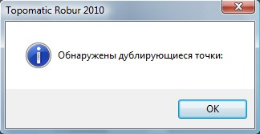

# Тестировать точки

Часто встречается ситуация когда одна и та же точка снимается несколько раз, поэтому на исходной поверхности могут появиться дублирующиеся точки.

Чтобы проверить поверхность на дублирование точек, выберите элемент меню **Поверхность – Точки – Тестировать точки**.

Программа просматривает все точки и те точки, расстояния между которыми меньше чем **1 см**, будут помечены как **Дублирующиеся**.

Если при тестировании обнаружены дублирующиеся точки, программа выдает сообщение и выделит все дублирующиеся точки на экране определенным цветом, заданным в настройках программы:

При необходимости дублирующие точки могут “**отсеены**”. Такая операция называется [корректированием](correction_dots.md).
